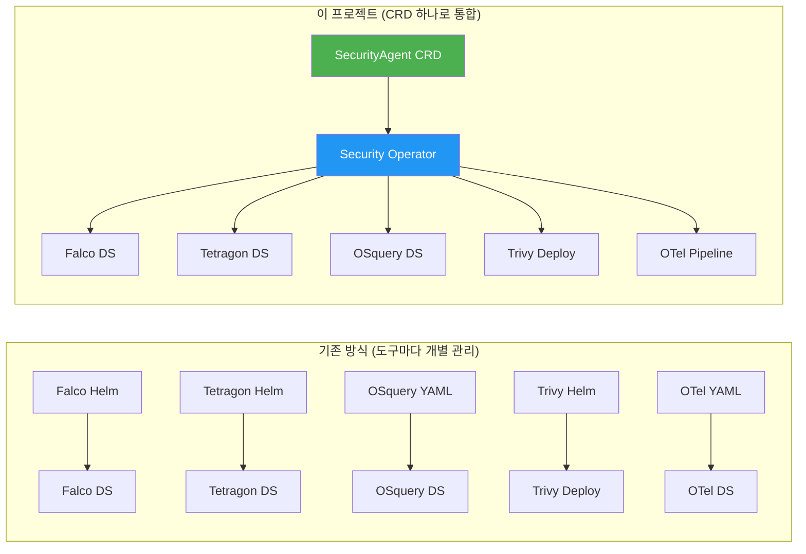
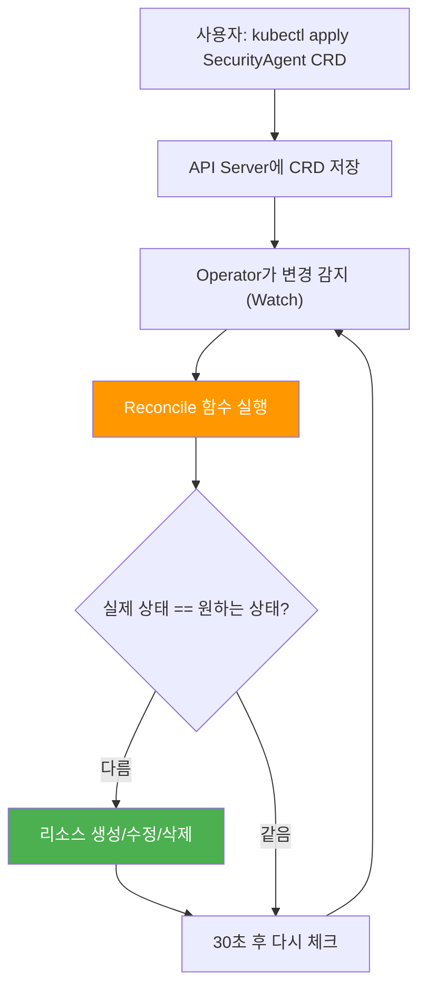
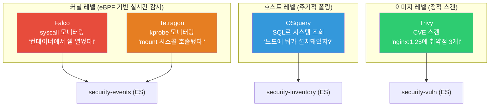
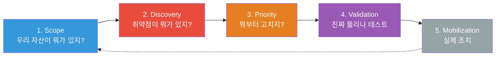
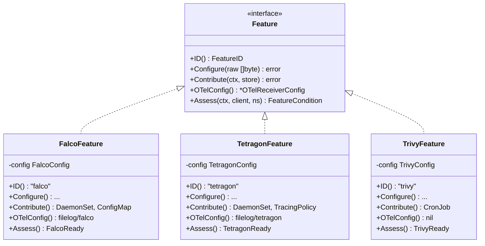
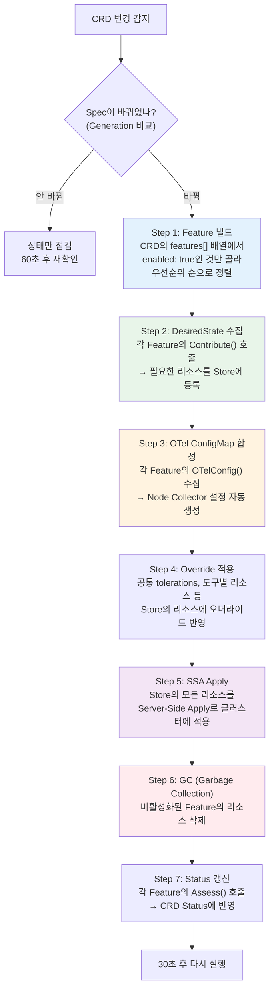
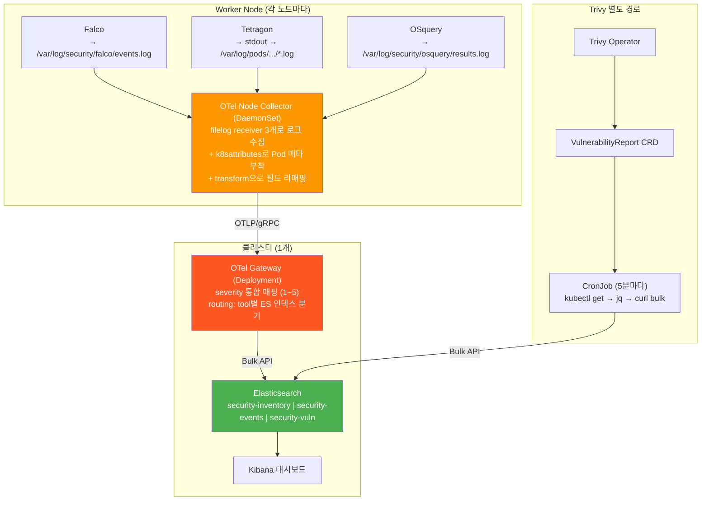
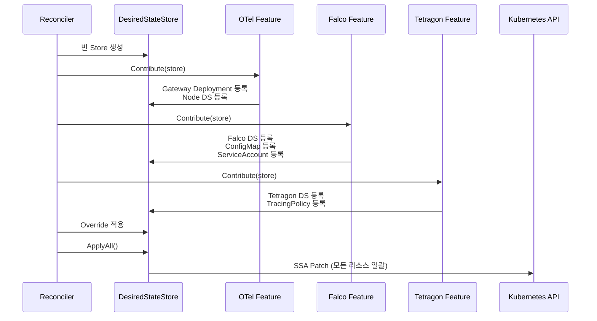
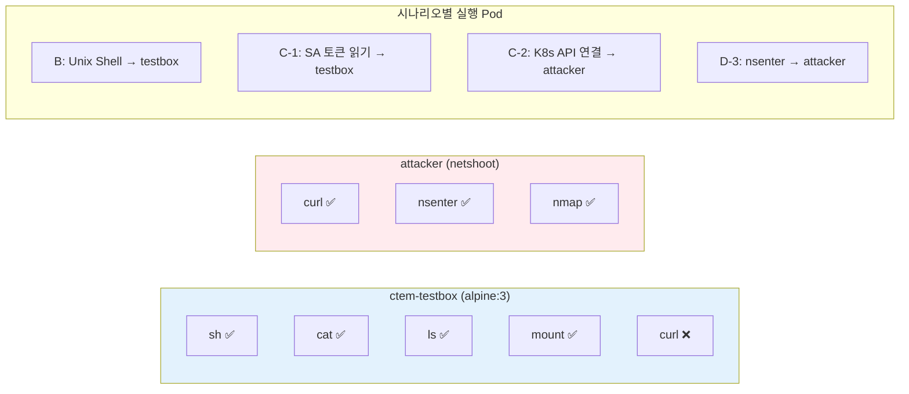
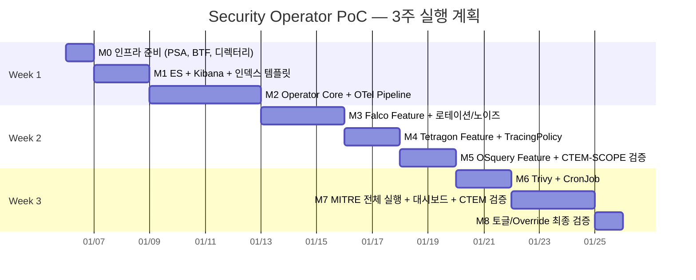

# Security Operator PoC 해설서

> **대상 독자**: DevOps 경력자 중 Go 초보 + Kubernetes Operator 첫 개발자
> **이 문서의 목적**: `security-operator-poc-plan-v4.md`의 "왜 이렇게 설계했는가"를 실무 관점에서 풀어 설명

---

## 1. 이 프로젝트가 해결하려는 문제

쿠버네티스 클러스터에 보안 도구를 붙이려면 보통 이런 과정을 거칩니다.

Falco를 Helm으로 설치하고, Tetragon도 Helm으로 따로 설치하고, OSquery는 DaemonSet YAML을 직접 작성해서 `kubectl apply`하고, Trivy Operator는 또 별도로 설치합니다. 각 도구마다 설정 파일이 다르고, 로그 수집 파이프라인도 따로 구성해야 하고, Elasticsearch 인덱스도 각각 만들어야 합니다. 하나를 끄거나 설정을 바꾸려면 여러 리소스를 일일이 찾아서 수정해야 합니다.

이 프로젝트의 핵심 아이디어는 단순합니다. **CRD(Custom Resource Definition) 하나만 `kubectl apply`하면 4개 보안 도구 + 로그 수집 파이프라인이 한 번에 배포되는 Operator를 만들자**는 것입니다. 도구를 켜고 끄는 건 YAML에서 `enabled: true/false`만 바꾸면 되고, 리소스 설정 변경도 하나의 CRD에서 합니다.



---

## 2. Kubernetes Operator가 뭔지부터

DevOps 경력이 있다면 Helm Chart나 Kustomize로 리소스를 배포하는 건 익숙할 겁니다. Operator는 한 발 더 나아간 개념입니다.

Helm은 "템플릿을 렌더링해서 리소스를 만들어주는 도구"입니다. 한 번 배포하고 나면 끝입니다. 누가 실수로 DaemonSet을 지워도 Helm은 모릅니다.

Operator는 **쿠버네티스 안에서 계속 돌면서 "원하는 상태(Desired State)"와 "실제 상태(Current State)"를 비교하고, 다르면 맞춰주는 컨트롤러**입니다. DaemonSet이 지워지면 다시 만들어줍니다. 설정이 바뀌면 업데이트합니다. 이걸 **Reconcile(조정) 루프**라고 부릅니다.



실무적으로 비유하면, Operator는 **무한으로 돌아가는 Ansible Playbook**이라고 생각하면 됩니다. 단, 쿠버네티스 API를 직접 쓰기 때문에 Ansible보다 훨씬 빠르고 정밀합니다.

---

## 3. 프로젝트에 쓰이는 도구 4개 — 역할 정리

여기서 처음 볼 수 있는 도구들이 있을 텐데, 각각 하는 일이 다릅니다. 아래 그림이 핵심입니다.



각 도구의 동작 방식을 DevOps 관점에서 설명하면 이렇습니다.

**Falco**는 리눅스 커널의 syscall을 eBPF로 모니터링합니다. "컨테이너 안에서 `/bin/sh`가 실행됐다", "SA 토큰 파일을 읽었다" 같은 이벤트를 실시간으로 잡아냅니다. DaemonSet으로 각 노드에 배포되고, privileged 권한이 필요합니다. Prometheus의 node_exporter가 각 노드에 뜨는 것과 같은 패턴인데, 메트릭 대신 보안 이벤트를 수집한다고 보면 됩니다.

**Tetragon**은 Cilium 팀이 만든 도구로, Falco와 비슷하게 eBPF 기반이지만 kprobe(커널 함수 후킹)를 씁니다. `mount`, `setns` 같은 특정 시스콜을 정밀하게 모니터링할 수 있어서, 컨테이너 탈출(Container Escape) 같은 고급 공격을 잡는 데 강합니다. TracingPolicy라는 자체 CRD로 "어떤 커널 함수를 감시할지"를 선언합니다.

**OSquery**는 Facebook이 만든 도구로, SQL 쿼리로 시스템 상태를 조회합니다. `SELECT * FROM listening_ports`처럼 쿼리를 보내면 현재 열린 포트 목록을 돌려줍니다. 실시간 감지가 아니라 **주기적으로 현황을 찍는 인벤토리 수집기**입니다. "지금 이 노드에 뭐가 돌아가고 있는지" 파악하는 용도입니다.

**Trivy**는 컨테이너 이미지의 CVE(취약점)를 스캔합니다. "이 nginx 이미지에 Critical 취약점이 3개 있고, 패치 버전은 뭐다"를 알려줍니다. Trivy Operator를 설치하면 클러스터 내 모든 이미지를 자동으로 스캔하고 결과를 VulnerabilityReport CRD로 저장합니다.

Falco와 Tetragon이 둘 다 eBPF를 쓰는데 왜 둘 다 쓰느냐고 의문이 들 수 있습니다. 핵심은 **교차검증(Cross-Validation)**입니다. 같은 공격 행위를 두 도구가 각각 다른 방식으로 탐지하면, 한쪽이 놓쳐도 다른 쪽이 잡아냅니다. 그리고 각 도구의 강점이 다릅니다. Falco는 넓은 범위의 룰 기반 탐지에 강하고, Tetragon은 특정 커널 함수를 정밀하게 추적하는 데 강합니다.

---

## 4. CTEM이 뭐고, 왜 이 구조로 ES 인덱스를 나눴나

CTEM(Continuous Threat Exposure Management)은 Gartner가 2022년에 제안한 보안 프레임워크입니다. 핵심은 "보안을 한 번 점검하고 끝내지 말고, 5단계 사이클을 계속 돌려라"는 것입니다.



이 프로젝트에서 ES 인덱스를 3개로 나눈 이유가 바로 이 CTEM 단계와 매핑하기 위해서입니다.

**`security-inventory`** (CTEM Scope 단계)는 "우리한테 뭐가 있는지"를 저장합니다. OSquery가 수집하는 노드 정보, 열린 포트, 돌아가는 컨테이너 목록 같은 인벤토리 데이터가 여기 들어갑니다.

**`security-vuln`** (CTEM Discovery/Priority 단계)는 "취약점이 뭐가 있고, 얼마나 심각한지"를 저장합니다. Trivy가 스캔한 CVE 정보가 여기 들어갑니다. CVSS 점수로 우선순위를 매길 수 있습니다.

**`security-events`** (CTEM Validation 단계)는 "실제 공격 시뮬레이션 시 탐지됐는지"를 저장합니다. Falco와 Tetragon이 잡아낸 보안 이벤트가 여기 들어갑니다.

인덱스를 하나로 합치지 않고 나눈 이유는, 각 인덱스의 데이터 성격과 보존 주기가 다르기 때문입니다. 인벤토리는 천천히 바뀌고, 이벤트는 실시간으로 쏟아지고, 취약점은 스캔 주기마다 갱신됩니다. Kibana에서 CTEM 단계별로 대시보드를 만들 때도 인덱스가 나뉘어 있으면 편합니다.

---

## 5. Feature-as-Plugin 아키텍처 — 이 설계의 핵심

이 프로젝트에서 가장 중요한 설계 결정은 **Feature-as-Plugin 패턴**입니다. Datadog Operator에서 영감을 받은 이 패턴을 이해하면 전체 코드 구조가 한눈에 들어옵니다.

### 5.1 문제: 도구를 추가할 때마다 Reconciler를 수정해야 한다면?

만약 Reconciler(조정 루프) 안에 도구별 로직을 직접 넣으면 이런 코드가 됩니다.

```go
// ❌ 나쁜 예: 도구가 추가될 때마다 Reconciler를 수정해야 함
func Reconcile() {
    if spec.Falco.Enabled {
        // Falco DaemonSet 생성 로직 200줄...
    }
    if spec.Tetragon.Enabled {
        // Tetragon DaemonSet 생성 로직 200줄...
    }
    // 새 도구 추가? → 여기에 또 200줄 추가...
}
```

도구가 5개면 Reconciler가 1000줄이 되고, 도구를 추가할 때마다 Reconciler를 건드려야 합니다. 실수로 다른 도구 로직을 건드릴 위험도 있습니다.

### 5.2 해결: Feature 인터페이스 + 자기등록

이 프로젝트는 **각 도구를 Feature라는 인터페이스로 추상화**합니다. Reconciler는 Feature 인터페이스만 알고, 구체적인 도구(Falco, Tetragon 등)는 모릅니다.



4개 메서드가 각각 무슨 역할인지 실무적으로 설명하면 이렇습니다.

**`Configure(raw []byte)`** — CRD에서 이 도구의 설정값(`config` 필드)을 받아서 파싱합니다. 예를 들어 Falco라면 `{"driver": "modern_ebpf", "jsonOutput": true}`를 `FalcoConfig` 구조체로 변환합니다. 여기서 `RawExtension`이라는 걸 쓰는데, 이건 "아무 JSON이나 담을 수 있는 필드"입니다. 덕분에 CRD 스키마를 바꾸지 않고도 도구별로 다른 설정을 넣을 수 있습니다.

**`Contribute(ctx, store)`** — 이 도구가 필요한 쿠버네티스 리소스(DaemonSet, ConfigMap, ServiceAccount, TracingPolicy 등)를 `DesiredStateStore`에 등록합니다. "나는 이런 리소스들이 필요해"라고 선언하는 것입니다. 실제 `kubectl apply`는 Reconciler가 나중에 일괄로 합니다.

**`OTelConfig()`** — 이 도구의 로그를 OTel Collector가 수집하려면 어떤 filelog 설정이 필요한지 반환합니다. Falco라면 "파일 경로는 `/var/log/security/falco/events.log`, 포맷은 JSON, 대상 인덱스는 events"를 반환합니다. Trivy처럼 OTel을 안 쓰는 도구는 `nil`을 반환합니다.

**`Assess(ctx, client, ns)`** — 이 도구가 정상 동작하는지 확인합니다. Falco라면 DaemonSet의 Ready Pod 수를 체크해서 "FalcoReady: 2/2"를 반환합니다. 이게 CRD의 Status에 반영됩니다.

### 5.3 자기등록(Self-Registration) — Go의 init() 트릭

각 Feature 파일에는 `init()` 함수가 있습니다. Go에서 `init()`은 패키지가 import될 때 자동으로 실행되는 특수 함수입니다. 이걸 이용해서 **Feature가 스스로를 Registry에 등록**합니다.

```go
// internal/controller/feature/falco/feature.go
func init() {
    // 이 한 줄로 Falco Feature가 Registry에 등록됨
    // Priority 100 = 센서 계층 (OTel Pipeline은 10으로 먼저 실행)
    feature.Register(feature.FalcoFeatureID, 100, func() feature.Feature {
        return &falcoFeature{}
    })
}
```

그리고 `cmd/main.go`에서 blank import(`_ "..."`)로 패키지를 로드하면 `init()`이 자동 실행됩니다.

```go
// cmd/main.go — 이것만 추가하면 새 도구가 등록됨
import (
    _ "github.com/example/security-operator/internal/controller/feature/falco"
    _ "github.com/example/security-operator/internal/controller/feature/tetragon"
    // 새 도구 추가? → 여기에 import 1줄만 추가
)
```

DevOps 관점에서 비유하면, **Terraform Provider**가 자동으로 등록되는 것과 비슷합니다. `terraform init`하면 provider가 알아서 등록되듯이, import 한 줄이면 Feature가 Operator에 등록됩니다.

### 5.4 새 도구 추가 = 3단계

이 아키텍처의 최대 장점은, 새 보안 도구를 추가할 때 기존 코드를 **전혀 건드리지 않는다**는 것입니다.


---

## 6. Reconciler 동작 흐름 — 7단계

Reconciler는 Feature들을 오케스트레이션하는 엔진입니다. CRD가 생성/수정/삭제될 때마다 아래 7단계를 실행합니다.



각 단계에서 DevOps 경험이 있다면 익숙한 개념들이 나옵니다.

**Step 1의 우선순위 정렬**은 Ansible의 role 실행 순서와 비슷합니다. OTel Pipeline(Priority 10)이 센서(Priority 100)보다 먼저 실행되어야, 센서가 로그를 쓸 때 수집 인프라가 이미 준비되어 있습니다.

**Step 5의 SSA(Server-Side Apply)**는 `kubectl apply`의 내부 동작입니다. `client.Patch`에 `client.Apply` 옵션을 주면 "이 필드는 내가 관리한다"를 선언합니다. 다른 컨트롤러가 같은 리소스를 관리해도 충돌하지 않습니다. Terraform의 state 관리와 비슷한 역할입니다.

**Step 6의 GC**는, 예를 들어 사용자가 `falco.enabled: false`로 바꾸면 Falco DaemonSet을 자동으로 삭제하는 것입니다. 네임스페이스 스코프 리소스는 OwnerReference로 자동 GC되고, 클러스터 스코프 리소스(ClusterRole 등)는 Finalizer로 수동 삭제합니다.

### 무한 루프 방지 — 실무에서 자주 겪는 함정

Operator 개발 시 가장 흔한 버그가 **무한 Reconcile 루프**입니다. Status를 업데이트하면 CRD가 변경되고, 변경이 감지되면 또 Reconcile이 돌고, 또 Status를 업데이트하고... 이 무한 루프를 두 가지 장치로 막습니다.

첫째, **`GenerationChangedPredicate`**를 씁니다. 쿠버네티스에서 `metadata.generation`은 spec이 바뀔 때만 증가하고, status가 바뀔 때는 증가하지 않습니다. 이 Predicate를 걸면 spec 변경 시에만 Reconcile이 트리거됩니다.

둘째, **`ObservedGeneration` 패턴**을 씁니다. Reconcile이 성공하면 현재 `generation`을 `status.observedGeneration`에 저장합니다. 다음 Reconcile에서 둘이 같으면 "이미 처리했으니 상태 점검만 하자"고 판단합니다.

이 두 패턴은 쿠버네티스 공식 문서에서도 권장하는 표준 패턴이니, Operator 개발할 때 반드시 적용해야 합니다.

---

## 7. 데이터 플로우 — 로그가 ES까지 가는 경로

보안 도구가 이벤트를 생성하면, 그 데이터가 Elasticsearch까지 어떻게 흘러가는지가 이 프로젝트의 또 다른 핵심입니다.



### 도구별로 로그 수집 방식이 다른 이유

여기서 DevOps 경험이 있는 분이라면 "왜 도구마다 로그 경로가 다르지?"라고 의문이 들 텐데, 각 도구의 출력 특성 때문입니다.

**Falco**는 `file_output`으로 직접 파일에 씁니다. Falco JSON에는 이미 `k8s.ns.name`, `k8s.pod.name` 같은 쿠버네티스 메타데이터가 포함되어 있기 때문에, OTel의 `transform` 프로세서로 이 필드들을 표준 필드로 리매핑합니다.

**Tetragon**은 stdout으로 출력합니다. kubelet이 자동으로 `/var/log/pods/` 하위에 컨테이너 로그를 만들어주므로, OTel의 `k8sattributes` 프로세서가 Pod 로그 경로에서 자동으로 Pod 메타데이터를 붙여줍니다. kubectl logs로 로그를 볼 수 있어서 디버깅도 편합니다.

**OSquery**는 파일 출력인데, 수집하는 게 노드 인벤토리(호스트 정보)라서 Pod 메타데이터가 필요 없습니다. `hostIdentifier` 필드에 노드 이름이 들어있어서, 이걸 `k8s.node.name`으로 매핑합니다.

**Trivy**는 아예 OTel을 안 씁니다. Trivy Operator가 VulnerabilityReport CRD를 만들면, CronJob이 5분마다 `kubectl get vulnerabilityreports`로 결과를 가져와서 jq로 가공한 후 ES에 직접 Bulk Insert합니다. `_id`를 `<UID>:<CVE>:<패키지>`로 고정해서 중복을 방지합니다.

### OTel Node vs Gateway — 2계층 구조

OTel Collector를 왜 Node(DaemonSet)와 Gateway(Deployment) 2계층으로 나눴는지 궁금할 수 있습니다.

**Node Collector**는 각 워커 노드에서 로그를 수집하고 1차 가공(파싱, 메타데이터 부착)을 합니다. 로그 파일은 로컬에 있으니까 DaemonSet이어야 합니다.

**Gateway**는 모든 노드에서 온 로그를 받아서 2차 가공(severity 통합 매핑, 인덱스 라우팅)을 하고 ES에 보냅니다. 이건 클러스터에 1개만 있으면 되니까 Deployment입니다.

이 2계층 구조의 장점은, ES 연결 설정(인증, TLS)을 Gateway 한 곳에서만 관리한다는 것입니다. Node Collector는 Gateway의 OTLP 엔드포인트만 알면 됩니다.

---

## 8. CRD 설계 — 배열 기반의 의미

CRD의 `features` 필드가 왜 배열(`[]FeatureSpec`)인지가 중요합니다.

만약 도구별로 타입을 정의하면 이렇게 됩니다.

```yaml
# ❌ 나쁜 예: 도구가 추가될 때마다 CRD 스키마를 변경해야 함
spec:
  falco:
    enabled: true
    driver: "modern_ebpf"
  tetragon:
    enabled: true
    exportMode: "stdout"
  # 새 도구 추가? → CRD 스키마 변경 + 재배포 필요
```

배열 기반이면 이렇습니다.

```yaml
# ✅ 좋은 예: CRD 스키마 변경 없이 새 도구 추가 가능
spec:
  features:
    - name: falco
      enabled: true
      config: { driver: "modern_ebpf" }     # RawExtension
    - name: tetragon
      enabled: true
      config: { exportMode: "stdout" }       # RawExtension
    - name: newtool                          # 스키마 변경 없이 추가!
      enabled: true
      config: { whatever: "value" }
```

`config` 필드에 `runtime.RawExtension`을 쓰면 "아무 JSON이나 담을 수 있는 필드"가 됩니다. Go의 `json.RawMessage`와 비슷한 개념입니다. Terraform에서 `any` 타입 변수를 쓰는 것과 비슷하다고 생각하면 됩니다.

---

## 9. DesiredStateStore — 리소스 수집 패턴

Reconciler가 Feature들을 호출할 때, 각 Feature가 직접 `kubectl apply`를 하지 않습니다. 대신 **DesiredStateStore**라는 중앙 저장소에 "나는 이런 리소스가 필요해"를 등록합니다. 모든 Feature가 등록을 마치면, Reconciler가 한 번에 Apply합니다.



이 패턴의 장점은 **트랜잭션처럼 동작한다**는 것입니다. Feature가 하나라도 에러를 내면 아무것도 Apply되지 않습니다. 그리고 Override를 적용할 때 Store에 있는 리소스를 한 번에 수정할 수 있습니다.

---

## 10. Override 2단계 — 운영 현실 반영

실무에서 보안 도구를 운영하다 보면 "모든 DaemonSet에 taint toleration을 추가해야 해" 같은 공통 요구사항과 "Falco만 메모리를 늘려야 해" 같은 개별 요구사항이 동시에 생깁니다.

```yaml
spec:
  override:
    # 1단계: 공통 — 모든 DaemonSet에 적용
    nodeAgent:
      tolerations:
        - operator: Exists     # 모든 taint를 tolerate

    # 2단계: 도구별 — 해당 도구에만 적용 (공통보다 우선)
    falco:
      resources:
        limits:
          memory: "2Gi"        # Falco만 메모리 2Gi로
```

Helm에서 `values.yaml`의 global과 per-component 설정이 있는 것과 같은 패턴입니다. Operator는 이 Override를 DesiredStateStore의 리소스에 자동으로 병합합니다.

---

## 11. MITRE ATT&CK 테스트 — 왜 Pod를 2개로 나눴나

테스트 시나리오에서 `ctem-testbox`(alpine)와 `attacker`(netshoot)를 따로 만든 이유가 있습니다. **컨테이너 이미지마다 포함된 바이너리가 다르기 때문**입니다.

alpine에는 `sh`, `cat`, `ls`, `mount`는 있지만 `curl`, `nsenter`는 없습니다. netshoot에는 네트워크 디버깅 도구(`curl`, `nmap`, `nsenter` 등)가 다 들어있습니다. 시나리오별로 필요한 바이너리가 있는 Pod에서 실행해야 "바이너리가 없어서 탐지 실패"하는 상황을 방지할 수 있습니다.



그리고 `target-nginx`(nginx:1.25)는 공격 행위를 실행하지 않고, Trivy가 CVE를 스캔하는 대상 전용입니다. 오래된 버전의 nginx를 일부러 쓰는 이유는 알려진 CVE가 있어서 Trivy의 Discovery/Priority 검증에 사용할 수 있기 때문입니다.

---

## 12. Elasticsearch 매핑 — flattened 타입의 중요성

ES 인덱스 템플릿 설계에서 눈여겨볼 부분이 있습니다.

Falco의 `output_fields`와 OSquery의 `columns`에 **`flattened` 타입**을 쓰고 있습니다. 이 필드들은 룰이나 쿼리에 따라 구조가 달라지는 가변 필드입니다. 일반 `object` 타입을 쓰면 새로운 하위 필드가 들어올 때마다 ES가 매핑을 자동 생성하는데, 이게 쌓이면 "mapping explosion" 문제가 생길 수 있습니다. `flattened`는 하위 구조 전체를 하나의 필드로 취급해서 이 문제를 방지합니다.

그리고 모든 필드가 **객체 구조(`properties` 중첩)**로 정의되어 있는 이유는, dot notation 매핑 충돌을 방지하기 위해서입니다. `kubernetes.namespace`를 string으로 먼저 인덱싱했는데 나중에 `kubernetes.namespace.name`이 들어오면 ES가 에러를 냅니다. 처음부터 객체 구조로 잡아놓으면 이 문제가 없습니다.

---

## 13. 리스크 관리 — 실무에서 주의할 점 Top 5

계획서의 리스크 테이블에서 실제로 겪을 가능성이 높은 것 5가지를 뽑았습니다.

**1. Falco 노이즈로 ES 터짐 (R7)** — Falco는 기본 룰이 매우 많고, 아무 설정 없이 돌리면 분당 수백 건의 이벤트가 쏟아집니다. 계획서에서 `falco_rules.local.yaml`로 노이즈가 심한 룰 5개를 비활성화하고, "테스트 행위 없이 5분간 50건 이하" 기준을 세운 이유가 이것입니다.

**2. 로그 로테이션 미설정으로 디스크 풀 (R8)** — Falco가 파일로 로그를 쓰는데, 로테이션을 안 걸면 디스크가 꽉 찹니다. 48시간 모니터링이 필수입니다. `max_size: 100MB, max_files: 3`으로 최대 300MB만 사용하도록 설정합니다.

**3. Reconcile 무한 루프 (R5)** — 위에서 설명한 대로 `GenerationChangedPredicate` + `ObservedGeneration` 패턴으로 방지합니다.

**4. k8sattributes가 Falco 로그에 Pod 메타를 못 붙임 (R2)** — Falco는 파일로 로그를 쓰기 때문에 k8sattributes 프로세서가 "이 로그가 어떤 Pod에서 왔는지" 알 수 없습니다. 그래서 Falco는 자체 JSON에 포함된 k8s 메타를 transform으로 리매핑하고, Tetragon은 stdout + k8sattributes 자동 매핑을 씁니다. 이게 "하이브리드 방식"입니다.

**5. 시나리오 Pod에 바이너리 없어서 탐지 실패 (R9)** — 위에서 설명한 Pod 역할 분리로 해결합니다.

---

## 14. 마일스톤 — 3주 로드맵 시각화



각 마일스톤의 Exit Criteria(완료 조건)가 계획서에 체크리스트로 정리되어 있으니, 매일 퇴근 전에 해당 마일스톤의 체크리스트를 확인하면 됩니다. 특히 M2(Operator Core)가 가장 길고 어려운 구간이니, 여기에 시간을 충분히 할당해야 합니다.

---

## 15. Go 초보자를 위한 핵심 개념 정리

이 프로젝트에서 쓰이는 Go 특유의 패턴들이 있습니다. 다른 언어 경험이 있다면 아래 대응표가 도움이 될 것입니다.

**Interface**: Java/TypeScript의 Interface와 동일합니다. `Feature` 인터페이스를 구현(implement)하면 어떤 구조체든 Feature로 동작할 수 있습니다.

**`init()` 함수**: Python의 모듈 레벨 코드, Java의 static initializer block과 비슷합니다. 패키지가 import될 때 자동 실행됩니다.

**Blank import (`_ "pkg"`)**: 패키지의 `init()`만 실행하고 나머지는 안 쓸 때 사용합니다. `_`는 "사용하지 않는 변수"를 의미합니다.

**`runtime.RawExtension`**: "일단 raw JSON으로 받아두고, 나중에 구체적인 타입으로 파싱하겠다"는 의미입니다. TypeScript의 `any`와 비슷하지만, 명시적으로 디코딩해야 하므로 더 안전합니다.

**`context.Context`**: 요청의 생명주기를 관리하는 객체입니다. HTTP 핸들러에서 request context를 넘기듯이, Reconcile 함수에 context를 전달해서 타임아웃이나 취소를 처리합니다.

**`client.Client`**: 쿠버네티스 API를 Go에서 호출하는 클라이언트입니다. `kubectl get`, `kubectl apply`, `kubectl delete`에 대응하는 `Get()`, `Patch()`, `Delete()` 메서드가 있습니다.

---

## 16. 프로젝트 디렉터리 — 어디서부터 읽어야 하나

```
security-operator/
├── cmd/main.go                          ← 🟢 여기서 시작. Feature import 목록 확인
│
├── api/v1alpha1/
│   └── securityagent_types.go           ← 🟡 CRD 구조 이해 (Go 타입 = YAML 스키마)
│
├── internal/controller/
│   ├── reconciler.go                    ← 🔴 핵심. 7단계 Reconcile 루프
│   └── feature/
│       ├── feature.go                   ← 🟡 Feature 인터페이스 정의
│       ├── registry.go                  ← 🟡 자기등록 + 우선순위 정렬
│       ├── store.go                     ← 🟡 DesiredStateStore
│       ├── falco/feature.go             ← 🔵 Falco 구현 (가장 복잡, 참고용)
│       ├── tetragon/feature.go          ← 🔵 Tetragon 구현
│       ├── osquery/feature.go           ← 🔵 OSquery 구현 (가장 단순)
│       └── trivy/feature.go             ← 🔵 Trivy 구현 (OTel 없는 케이스)
│
├── test/
│   ├── pods.yaml                        ← 테스트 Pod 정의
│   └── run-ctem-scenarios.sh            ← 전체 테스트 자동화
│
└── config/
    └── elasticsearch/
        └── index-templates.sh           ← ES 인덱스 템플릿 생성
```

코드를 읽는 순서는 이렇게 추천합니다. 먼저 `api/v1alpha1/securityagent_types.go`로 CRD 구조를 파악하고, `feature/feature.go`로 인터페이스를 이해한 다음, `feature/osquery/feature.go`(가장 단순한 구현)를 읽어보고, 그 다음 `reconciler.go`로 전체 흐름을 파악하면 됩니다. Falco Feature는 가장 복잡하니까 마지막에 읽으면 좋습니다.

---

## 17. 자주 하는 실수와 트러블슈팅

### CRD 변경 후 Operator가 반응하지 않을 때

Status만 바꾼 게 아닌지 확인합니다. `GenerationChangedPredicate` 때문에 spec 변경만 Reconcile을 트리거합니다.  `kubectl get securityagent -o yaml`로 `metadata.generation`과 `status.observedGeneration`을 비교해봅니다.

### Falco 이벤트가 ES에 안 들어올 때

디버깅 순서는 아래에서 위로 올라갑니다. 먼저 Falco Pod에서 로그 파일이 생성되는지 확인합니다 (`kubectl exec falco-xxx -- ls -la /var/log/security/falco/`). 그 다음 OTel Node Collector 로그에서 filelog receiver가 해당 파일을 읽고 있는지 확인합니다. 마지막으로 OTel Gateway 로그에서 ES로 Bulk Insert가 성공하는지 확인합니다.

### Tetragon TracingPolicy가 동작하지 않을 때

`kubectl get tracingpolicy`로 CRD가 생성되었는지 확인합니다. Tetragon Feature가 `Unstructured`로 TracingPolicy를 등록하는데, Tetragon CRD가 클러스터에 먼저 설치되어 있어야 합니다. Tetragon DS가 뜨면서 CRD를 자동으로 등록하니까, DS가 Ready된 후 TracingPolicy가 생기는 순서가 맞는지 체크합니다.

### ES 매핑 충돌 에러

`security-events` 인덱스에 처음 들어온 문서의 필드 구조와 나중에 들어온 문서의 구조가 다르면 매핑 충돌이 납니다. 이를 방지하려고 인덱스 템플릿을 먼저 생성합니다 (M1 단계). 문제가 생기면 인덱스를 삭제하고 템플릿을 재생성한 후 새로 인덱싱합니다.

---

## 18. 이 PoC 이후에는 — Phase B 미리보기

계획서에서 "비목표"로 명시한 것들이 Phase B의 로드맵입니다. Kafka 버퍼링(도구와 ES 사이에 Kafka를 넣어서 ES 장애 시 데이터 손실 방지), OCSF 정규화(모든 도구의 이벤트를 하나의 표준 스키마로 통합), Correlation Engine(서로 다른 도구의 이벤트를 연결해서 "이 공격은 이런 킬체인이다"를 자동 분석), 그리고 Mobilization(Kibana Alert나 Slack 알림으로 실제 조치를 유도)이 여기에 해당합니다.

PoC의 성공 기준을 명확히 하고 비목표를 확정한 이유는, 3주라는 제한된 시간 안에 핵심 가치(CTEM 매핑 검증 + Feature-as-Plugin 아키텍처 증명)를 먼저 보여주기 위해서입니다. Phase B는 PoC 결과를 바탕으로 의사결정자의 승인을 받은 후 진행합니다.