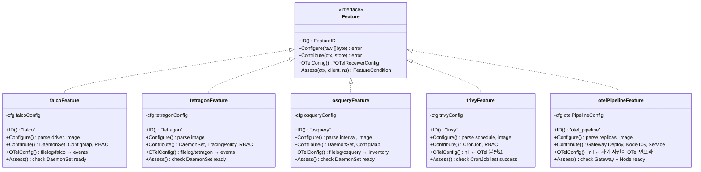

# Kubernetes Security Operator 개발기: Feature-as-Plugin 아키텍처로 보안 도구 통합하기

> Kubebuilder로 시작해서, Datadog Operator의 설계를 빌려, CTEM 프레임워크에 맞는 Security Operator를 만들기까지의 실무 기록.

## 들어가며

보안팀에서 Kubernetes 클러스터에 Falco, Tetragon, OSquery, Trivy 네 가지 보안 도구를 운영하고 있다고 가정해보겠습니다. 각 도구는 별도의 Helm chart으로 배포되고, 설정은 ConfigMap과 values.yaml에 흩어져 있으며, 로그는 각자 다른 경로에 쌓입니다. 도구를 추가하거나 빼려면 여러 manifest를 수정해야 하고, 전체 상태를 한눈에 보기도 어렵습니다.

이 글에서는 **단일 CRD(Custom Resource Definition) 하나로 이 모든 것을 선언적으로 관리하는 Kubernetes Operator**를 처음부터 구현한 과정을 공유합니다. Operator 개발이 처음인 분도 따라올 수 있도록, `kubebuilder init` 명령부터 E2E 테스트 통과까지 순서대로 설명합니다.

### 이 글에서 다루는 내용

- Kubebuilder로 프로젝트 스캐폴딩하기
- CRD 설계: 확장 가능한 배열 기반 Feature Spec
- Feature-as-Plugin 아키텍처: 인터페이스, 자동 등록, 우선순위
- 7단계 Reconcile Loop 구현
- OTel 로그 파이프라인 자동 합성
- Server-Side Apply(SSA)와 Garbage Collection
- envtest 유닛 테스트부터 Kind E2E 테스트까지

### 이 글에서 다루지 않는 내용

- Kubernetes Operator의 기초 개념 (controller-runtime, Reconcile 패턴)은 [Kubebuilder Book](https://book.kubebuilder.io/)을 참조하세요.
- 각 보안 도구(Falco, Tetragon, OSquery, Trivy)의 개별 설치/운영 방법

---

## 1. 왜 Operator인가?

### Helm chart 조합의 한계

```
# 기존: 도구마다 별도 Helm chart
helm install falco falcosecurity/falco -f falco-values.yaml
helm install tetragon cilium/tetragon -f tetragon-values.yaml
helm install trivy-operator aquasecurity/trivy-operator
# + OTel collector 설정, ES 인덱스 설정, RBAC 설정...
```

이 방식의 문제점:

1. **설정 파편화** — 각 chart의 values.yaml이 독립적이라 공통 설정(tolerations, nodeSelector)을 일괄 변경하기 어렵습니다.
2. **상태 파악 불가** — `kubectl get pods`로 개별 pod 상태는 볼 수 있지만, "보안 도구 전체가 정상인가?"라는 질문에 답하기 어렵습니다.
3. **로그 파이프라인 수동 관리** — 도구가 추가될 때마다 OTel Collector config를 수동으로 업데이트해야 합니다.

### Operator가 해결하는 것

```yaml
# 목표: YAML 하나로 전체 보안 스택 선언
apiVersion: security.ctem.io/v1alpha1
kind: SecurityAgent
metadata:
  name: ctem-security-agent
spec:
  features:
    - name: falco
      enabled: true
    - name: tetragon
      enabled: true
    - name: trivy
      enabled: true
  output:
    elasticsearch:
      url: "https://es:9200"
```

Operator는 이 YAML을 읽고 필요한 DaemonSet, Deployment, CronJob, ConfigMap, RBAC, OTel config를 자동으로 생성하고, 상태를 지속적으로 모니터링합니다.

---

## 2. 전체 아키텍처

### 시스템 구성도


### 데이터 흐름


핵심은 **각 보안 도구가 JSON 파일로 이벤트를 출력하면, OTel Node Collector가 filelog receiver로 수집해서 Gateway를 통해 Elasticsearch로 라우팅하는 구조**입니다. Trivy만 예외적으로 CronJob에서 직접 ES에 bulk 전송합니다.

---

## 3. 프로젝트 스캐폴딩

### Kubebuilder 초기화

```bash
# Kubebuilder 설치 (v4.12.0 기준)
curl -L -o kubebuilder https://go.kubebuilder.io/dl/latest/$(go env GOOS)/$(go env GOARCH)
chmod +x kubebuilder && mv kubebuilder /usr/local/bin/

# 프로젝트 생성
mkdir security-operator && cd security-operator
kubebuilder init --domain ctem.io --repo github.com/ctem/security-operator

# API 생성 (CRD + Controller)
kubebuilder create api --group security --version v1alpha1 --kind SecurityAgent \
  --resource --controller
```

이 명령이 만들어주는 핵심 파일들:

```
security-operator/
├── cmd/main.go                     # 진입점
├── api/v1alpha1/
│   ├── securityagent_types.go      # CRD 타입 정의 ← 여기를 수정
│   └── groupversion_info.go        # API 그룹/버전
├── internal/controller/
│   ├── securityagent_controller.go # Reconciler ← 여기를 수정
│   └── suite_test.go               # 테스트 환경 설정
├── config/
│   ├── crd/bases/                  # 자동 생성되는 CRD YAML
│   ├── rbac/                       # RBAC 매니페스트
│   └── manager/                    # Deployment 매니페스트
├── Makefile                        # 빌드/테스트/배포 자동화
└── Dockerfile                      # 멀티스테이지 빌드
```

### 프로젝트 디렉토리 구조 (최종)

Kubebuilder가 생성한 뼈대에 Feature 시스템을 추가한 최종 구조입니다:

```
security-operator/
├── cmd/main.go                                    # Entry point + Feature blank imports
├── api/v1alpha1/
│   └── securityagent_types.go                     # CRD 타입 정의
├── internal/controller/
│   ├── reconciler.go                              # 7단계 Reconcile Loop
│   ├── feature/
│   │   ├── feature.go                             # Feature 인터페이스 (5개 메서드)
│   │   ├── types.go                               # FeatureID, OTelReceiverConfig, FeatureCondition
│   │   ├── registry.go                            # 우선순위 기반 자동 등록
│   │   ├── store.go                               # DesiredStateStore + SSA Apply
│   │   ├── otel_pipeline/feature.go               # Priority 10 — OTel 인프라
│   │   ├── falco/feature.go                       # Priority 100 — syscall 모니터링
│   │   ├── tetragon/feature.go                    # Priority 100 — kprobe 모니터링
│   │   ├── osquery/feature.go                     # Priority 100 — 인벤토리 수집
│   │   └── trivy/feature.go                       # Priority 200 — CVE 스캔
│   ├── override/override.go                       # 2단계 Override 시스템
│   └── otel/config_builder.go                     # OTel YAML 합성
├── config/
│   ├── crd/bases/                                 # CRD YAML (자동 생성)
│   ├── rbac/                                      # RBAC (자동 생성)
│   ├── samples/                                   # 샘플 CRD
│   └── elasticsearch/                             # ES 인덱스 템플릿
└── test/
    ├── e2e/                                       # Kind 기반 E2E 테스트
    ├── pods.yaml                                  # MITRE ATT&CK 테스트 Pod
    └── run-ctem-scenarios.sh                      # 시나리오 테스트 스크립트
```

---

## 4. CRD 설계: 배열 기반 Feature Spec

Operator 개발에서 CRD 설계는 가장 중요한 결정입니다. 새 도구를 추가할 때마다 CRD 스키마를 변경해야 한다면 유지보수가 어려워집니다. 이 문제를 **배열 기반 FeatureSpec + `runtime.RawExtension`** 조합으로 해결했습니다.

### 타입 정의

```go
// api/v1alpha1/securityagent_types.go

type SecurityAgentSpec struct {
    Global   GlobalSpec    `json:"global,omitempty"`
    Features []FeatureSpec `json:"features"`          // 배열: 도구 추가/제거가 자유로움
    Output   OutputSpec    `json:"output"`             // 공통 출력 설정
    Override *OverrideSpec `json:"override,omitempty"` // 2단계 Override
}

type FeatureSpec struct {
    Name    string                `json:"name"`             // "falco", "tetragon" 등
    Enabled bool                  `json:"enabled"`          // true/false 토글
    Config  *runtime.RawExtension `json:"config,omitempty"` // 도구별 자유 형식 JSON
}
```

### 설계 포인트

**`runtime.RawExtension`이 핵심입니다.** CRD 스키마 입장에서는 `Config` 필드가 임의의 JSON 객체를 받을 수 있는 "자유 형식" 필드입니다. 실제 파싱은 각 Feature의 `Configure()` 메서드에서 합니다.


이 설계 덕분에 **새로운 보안 도구를 추가해도 CRD 스키마 변경이 필요 없습니다.** Feature 구현체를 만들고, `cmd/main.go`에 blank import 한 줄만 추가하면 됩니다.

### `*runtime.RawExtension` 포인터를 쓰는 이유

초기 구현에서 `Config runtime.RawExtension`(값 타입)으로 선언했다가 버그를 만났습니다. config를 생략한 Feature에서 `spec.Config.Raw`에 접근하면 nil 포인터 역참조가 발생합니다.

```go
// 잘못된 접근 (Config가 값 타입일 때)
raw = spec.Config.Raw  // Config가 zero-value라도 Raw는 nil → 이후 Unmarshal에서 문제

// 올바른 접근 (Config가 포인터일 때)
if spec.Config != nil && spec.Config.Raw != nil {
    raw = spec.Config.Raw
}
```

### Output Spec

모든 보안 도구의 로그가 최종적으로 도달하는 Elasticsearch 설정입니다:

```go
type OutputSpec struct {
    Elasticsearch *ElasticsearchSpec `json:"elasticsearch,omitempty"`
}

type ElasticsearchSpec struct {
    URL     string      `json:"url"`
    Indices IndicesSpec `json:"indices"`
    TLS     *TLSSpec    `json:"tls,omitempty"`
    Auth    *AuthSpec   `json:"auth,omitempty"`
}

type IndicesSpec struct {
    Events        string `json:"events,omitempty"`        // Falco + Tetragon
    Inventory     string `json:"inventory,omitempty"`     // OSquery
    Vulnerability string `json:"vulnerability,omitempty"` // Trivy
}
```

### Override Spec

운영 환경에서는 "모든 DaemonSet에 GPU 노드 toleration 추가" 같은 공통 오버라이드가 필요합니다. 2단계 오버라이드로 이를 지원합니다:

```yaml
override:
  # Level 1: 모든 DaemonSet에 적용
  nodeAgent:
    tolerations:
      - operator: Exists
        effect: NoSchedule
    resources:
      requests:
        cpu: "50m"
        memory: "64Mi"
  # Level 2: 특정 도구에만 적용 (Level 1 위에 덮어씀)
  perTool:
    falco:
      resources:
        requests:
          cpu: "100m"   # Falco만 CPU 더 할당
          memory: "128Mi"
```

---

## 5. Feature-as-Plugin 아키텍처

이 프로젝트의 핵심 설계입니다. Datadog Operator의 Feature 시스템에서 영감을 받았지만, PoC에 맞게 크게 단순화했습니다.

### Feature 인터페이스

모든 보안 도구 플러그인이 구현해야 하는 인터페이스입니다:

```go
// internal/controller/feature/feature.go

type Feature interface {
    // 고유 식별자 반환
    ID() FeatureID

    // FeatureSpec.Config의 raw JSON을 파싱
    Configure(raw []byte) error

    // 이 Feature가 필요로 하는 K8s 리소스를 store에 추가
    Contribute(ctx context.Context, store *DesiredStateStore) error

    // OTel Node Collector의 filelog receiver 설정 반환 (nil이면 OTel 불필요)
    OTelConfig() *OTelReceiverConfig

    // 현재 상태를 점검하여 Condition 반환
    Assess(ctx context.Context, c client.Client, ns string) FeatureCondition
}
```



### 각 메서드의 역할

| 메서드 | 호출 시점 | 역할 | 예시 |
|--------|-----------|------|------|
| `ID()` | 등록/식별 | Feature 고유 이름 반환 | `"falco"` |
| `Configure()` | Reconcile Step 1 | raw JSON을 구조체로 파싱 | `{"driver":"modern_ebpf"}` → `falcoConfig{Driver:"modern_ebpf"}` |
| `Contribute()` | Reconcile Step 2 | K8s 리소스를 store에 등록 | DaemonSet, ConfigMap, ClusterRole 생성 |
| `OTelConfig()` | Reconcile Step 3 | OTel filelog receiver 설정 반환 | `filelog/falco` → `/var/log/security/falco/events.log*` |
| `Assess()` | Reconcile Step 7 | 현재 상태 점검 | DaemonSet NumberReady > 0이면 "Ready" |

### 자동 등록 (Self-Registration)

Go의 `init()` 함수와 blank import를 활용한 자동 등록 패턴입니다. 이 패턴 덕분에 Feature를 추가할 때 **레지스트리 코드를 수정할 필요가 없습니다.**

```go
// internal/controller/feature/falco/feature.go
func init() {
    feature.Register(feature.FalcoFeatureID, 100, func() feature.Feature {
        return &falcoFeature{}
    })
}
```

```go
// internal/controller/feature/registry.go
var (
    registry      = map[FeatureID]*registryEntry{}
    registryMutex sync.RWMutex
)

func Register(id FeatureID, priority int, factory func() Feature) {
    registryMutex.Lock()
    defer registryMutex.Unlock()

    if _, found := registry[id]; found {
        panic(fmt.Sprintf("feature %s is already registered", id))
    }
    registry[id] = &registryEntry{
        priority: priority,
        factory:  factory,
    }
}
```

```go
// cmd/main.go — blank import로 init() 트리거
import (
    _ "github.com/ctem/security-operator/internal/controller/feature/falco"
    _ "github.com/ctem/security-operator/internal/controller/feature/tetragon"
    _ "github.com/ctem/security-operator/internal/controller/feature/osquery"
    _ "github.com/ctem/security-operator/internal/controller/feature/trivy"
    _ "github.com/ctem/security-operator/internal/controller/feature/otel_pipeline"
)
```


### 우선순위 시스템

```go
func BuildActiveFeatures(specs []securityv1alpha1.FeatureSpec) ([]Feature, error) {
    // 1. enabled: true인 Feature만 필터링
    // 2. 각 Feature의 Configure() 호출
    // 3. priority 오름차순 정렬 (낮은 숫자가 먼저)
    sort.Slice(active, func(i, j int) bool {
        return active[i].priority < active[j].priority
    })
    return result, nil
}
```

| Priority | Feature | 이유 |
|----------|---------|------|
| **10** | otel_pipeline | OTel Collector가 먼저 배포되어야 다른 도구의 로그를 수집 가능 |
| **100** | falco, tetragon, osquery | 동일 우선순위 — 서로 독립적 |
| **200** | trivy | CronJob이므로 다른 인프라가 준비된 후 실행 |

---

## 6. DesiredStateStore: 리소스 축적과 SSA Apply

Feature들이 `Contribute()`에서 Kubernetes 리소스를 "등록"하면, 이를 모아두는 곳이 DesiredStateStore입니다.

### Store 구조

```go
// internal/controller/feature/store.go

type DesiredStateStore struct {
    namespace string

    DaemonSets          map[string]*appsv1.DaemonSet
    Deployments         map[string]*appsv1.Deployment
    CronJobs            map[string]*batchv1.CronJob
    ConfigMaps          map[string]*corev1.ConfigMap
    Services            map[string]*corev1.Service
    ServiceAccounts     map[string]*corev1.ServiceAccount
    ClusterRoles        map[string]*rbacv1.ClusterRole
    ClusterRoleBindings map[string]*rbacv1.ClusterRoleBinding
    Unstructured        map[string]*unstructured.Unstructured  // TracingPolicy 등 CRD
}
```

Feature가 리소스를 등록하면 Store가 namespace와 name을 자동으로 설정합니다:

```go
func (s *DesiredStateStore) AddDaemonSet(name string, ds *appsv1.DaemonSet) {
    ds.Name = name
    ds.Namespace = s.namespace
    s.DaemonSets[name] = ds
}
```

### Server-Side Apply (SSA)

기존의 `kubectl apply`(Client-Side Apply)와 달리, SSA는 **field ownership** 개념을 사용합니다. 각 필드의 "소유자"가 명확하기 때문에 충돌을 감지하고 해결할 수 있습니다.

```go
func ssaApply(ctx context.Context, c client.Client, obj client.Object) error {
    obj.SetManagedFields(nil)
    return c.Patch(ctx, obj, client.Apply,
        client.FieldOwner("security-operator"),  // 이 Operator가 소유하는 필드
        client.ForceOwnership,                    // 충돌 시 강제 적용
    )
}
```


### OwnerReference vs Labels

Kubernetes에서 OwnerReference를 설정하면 owner가 삭제될 때 자동으로 종속 리소스도 삭제됩니다(Garbage Collection). 하지만 **OwnerReference는 같은 namespace 내에서만 유효**합니다.

- **Namespaced 리소스** (DaemonSet, ConfigMap 등): OwnerReference 설정 → 자동 GC
- **Cluster-scoped 리소스** (ClusterRole, ClusterRoleBinding, TracingPolicy): Label 기반 수동 GC

```go
func setOwnerRef(owner *securityv1alpha1.SecurityAgent, obj client.Object,
    scheme *runtime.Scheme) error {
    // 다른 namespace면 OwnerRef 설정 불가 — label만 사용
    if obj.GetNamespace() != owner.Namespace {
        return nil
    }
    return controllerutil.SetControllerReference(owner, obj, scheme)
}
```

---

## 7. 7단계 Reconcile Loop

Reconciler는 SecurityAgent CRD의 변경을 감지하면 7단계 루프를 실행합니다. 각 단계가 실패하면 에러를 Status에 기록하고 재시도합니다.


### 실제 코드로 보는 Reconcile Loop

```go
// internal/controller/reconciler.go

func (r *SecurityAgentReconciler) Reconcile(ctx context.Context, req ctrl.Request) (ctrl.Result, error) {
    // ... instance 조회, finalizer 처리 ...

    // Step 1: Feature Build
    features, err := feature.BuildActiveFeatures(instance.Spec.Features)

    // Step 2: Desired State Collection
    store := feature.NewDesiredStateStore(ns)
    for _, feat := range features {
        feat.Contribute(ctx, store)
    }

    // Step 3: OTel ConfigMap Synthesis
    var otelReceivers []*feature.OTelReceiverConfig
    for _, feat := range features {
        if cfg := feat.OTelConfig(); cfg != nil {
            otelReceivers = append(otelReceivers, cfg)
        }
    }
    if len(otelReceivers) > 0 {
        nodeCM := otel.BuildNodeCollectorConfig(otelReceivers, instance.Spec.Output, ns)
        store.AddConfigMap(otel.NodeCollectorConfigMapName, nodeCM)
    }
    gatewayCM := otel.BuildGatewayConfig(instance.Spec.Output, ns)
    store.AddConfigMap(otel.GatewayConfigMapName, gatewayCM)

    // Step 4: Override Application
    override.ApplyOverrides(instance.Spec.Override, store)

    // Step 5: SSA Apply
    store.ApplyAll(ctx, r.Client, instance, r.Scheme)

    // Step 6: GC
    desiredKeys := store.GetAllResourceKeys()
    r.cleanupStale(ctx, instance, ns, desiredKeys)

    // Step 7: Status Update
    return r.updateStatus(ctx, instance, nil, features)
}
```

### 무한 루프 방지

Operator 개발에서 가장 흔한 실수는 **Status 업데이트가 다시 Reconcile을 트리거하는 무한 루프**입니다. 두 가지 방어 장치를 사용합니다:

**1. GenerationChangedPredicate**

Kubernetes에서 `.metadata.generation`은 `spec`이 변경될 때만 증가합니다. Status 업데이트는 generation을 변경하지 않습니다.

```go
func (r *SecurityAgentReconciler) SetupWithManager(mgr ctrl.Manager) error {
    return ctrl.NewControllerManagedBy(mgr).
        For(&securityv1alpha1.SecurityAgent{}).
        WithEventFilter(generationChangedPredicate()).  // spec 변경만 감지
        Owns(&appsv1.DaemonSet{}).                       // 소유한 리소스 변경도 감지
        Owns(&appsv1.Deployment{}).
        Complete(r)
}

func generationChangedPredicate() predicate.Predicate {
    return predicate.Funcs{
        UpdateFunc: func(e event.UpdateEvent) bool {
            if e.ObjectOld.GetGeneration() != e.ObjectNew.GetGeneration() {
                return true  // spec 변경 → Reconcile 실행
            }
            // SecurityAgent의 status-only 변경은 무시
            _, isSA := e.ObjectNew.(*securityv1alpha1.SecurityAgent)
            return !isSA  // 소유한 리소스(DS, Deploy 등) 변경은 항상 처리
        },
    }
}
```

**2. ObservedGeneration 패턴**

```go
statusCopy.Status.ObservedGeneration = instance.Generation
```

Status에 마지막으로 처리한 Generation을 기록합니다. 다음 Reconcile에서 `ObservedGeneration == Generation`이면 이미 처리 완료된 것입니다.

---

## 8. OTel 로그 파이프라인 자동 합성

이 Operator의 가장 차별화되는 기능입니다. Feature가 추가/제거될 때 OTel Collector 설정이 **자동으로 재생성**됩니다.

### Step 3에서 일어나는 일


### Node Collector Config 생성

```go
// internal/controller/otel/config_builder.go

var nodeCollectorTemplate = template.Must(template.New("node-collector").Parse(`
receivers:
{{- range .Receivers }}
  {{ .ReceiverName }}:
    include:
      - {{ .LogPath }}
    start_at: beginning
    include_file_path: true
    operators:
      - type: json_parser
        parse_from: body
      - type: add
        field: resource["security_tool"]
        value: "{{ index .Attributes "security_tool" }}"
{{- end }}

processors:
  batch:
    timeout: 5s
    send_batch_size: 1000

exporters:
  otlp:
    endpoint: "otel-gateway:4317"
    tls:
      insecure: true

service:
  pipelines:
    logs:
      receivers:
{{- range .Receivers }}
        - {{ .ReceiverName }}
{{- end }}
      processors:
        - resource
        - batch
      exporters:
        - otlp
`))
```

Falco를 비활성화하면? 다음 Reconcile에서 `OTelConfig()`가 호출되지 않으므로, Node Collector config에서 `filelog/falco` receiver가 자동으로 빠집니다.

### Gateway Routing

Gateway는 `security_tool` 속성을 기반으로 로그를 적절한 ES 인덱스로 라우팅합니다:

```yaml
connectors:
  routing:
    default_pipelines:
      - logs/events           # 기본: security-events 인덱스로
    table:
      - statement: route() where resource.attributes["security_tool"] == "osquery"
        pipelines:
          - logs/inventory    # osquery만 security-inventory로
```

---

## 9. Feature 구현 사례: Falco

실제로 Feature를 하나 구현하는 전체 과정을 Falco를 예로 살펴보겠습니다.

### 파일 구조

```
internal/controller/feature/falco/
└── feature.go    # 이 파일 하나가 전부
```

### Configure: config JSON 파싱

```go
type falcoConfig struct {
    Driver string `json:"driver,omitempty"`
    Image  string `json:"image,omitempty"`
}

func (f *falcoFeature) Configure(raw []byte) error {
    f.cfg.Driver = "modern_ebpf"  // 기본값 설정
    if len(raw) == 0 {
        return nil
    }
    return json.Unmarshal(raw, &f.cfg)
}
```

사용자가 CRD에서 `config: {"driver": "kmod"}`를 넣으면 기본값이 오버라이드됩니다.

### Contribute: K8s 리소스 생성

```go
func (f *falcoFeature) Contribute(ctx context.Context, store *feature.DesiredStateStore) error {
    image := falcoImage
    if f.cfg.Image != "" {
        image = f.cfg.Image
    }

    store.AddServiceAccount(falcoSAName, f.buildServiceAccount())
    store.AddClusterRole(falcoCRName, f.buildClusterRole())
    store.AddClusterRoleBinding(falcoCRBName, f.buildClusterRoleBinding(store))
    store.AddConfigMap(falcoCMName, f.buildConfigMap())
    store.AddDaemonSet(falcoDSName, f.buildDaemonSet(image))
    return nil
}
```

`buildDaemonSet()`에서는 privileged container, hostPID, 필요한 volume mount(dev, proc, boot 등)를 설정합니다. eBPF 기반 보안 도구는 호스트 커널에 접근해야 하므로 이런 설정이 필수입니다.

### OTelConfig: 로그 수집 설정

```go
func (f *falcoFeature) OTelConfig() *feature.OTelReceiverConfig {
    return &feature.OTelReceiverConfig{
        ReceiverName: "filelog/falco",
        LogPath:      "/var/log/security/falco/events.log*",
        ParseFormat:  "json",
        Attributes:   map[string]string{"security_tool": "falco"},
        TargetIndex:  "events",
    }
}
```

이 설정이 Reconcile Step 3에서 OTel Node Collector config에 자동 합성됩니다.

### Assess: 상태 점검

```go
func (f *falcoFeature) Assess(ctx context.Context, c client.Client, ns string) feature.FeatureCondition {
    ds := &appsv1.DaemonSet{}
    if err := c.Get(ctx, client.ObjectKey{Namespace: ns, Name: falcoDSName}, ds); err != nil {
        return feature.FeatureCondition{
            Type: "FalcoReady", Status: "False",
            Reason: "DaemonSetNotFound",
        }
    }
    if ds.Status.NumberReady == 0 {
        return feature.FeatureCondition{
            Type: "FalcoReady", Status: "False",
            Reason: "NotReady",
        }
    }
    return feature.FeatureCondition{
        Type: "FalcoReady", Status: "True",
        Reason: "Ready",
        Message: fmt.Sprintf("Falco running on %d/%d nodes",
            ds.Status.NumberReady, ds.Status.DesiredNumberScheduled),
    }
}
```

이 결과는 SecurityAgent의 `.status.conditions`에 반영됩니다:

```yaml
status:
  conditions:
    - type: FalcoReady
      status: "True"
      reason: Ready
      message: "Falco running on 3/3 nodes"
    - type: TetragonReady
      status: "True"
      reason: Ready
    - type: Ready
      status: "True"
      reason: ReconcileSuccess
      message: "All features reconciled successfully"
  features:
    falco: "True"
    tetragon: "True"
  observedGeneration: 5
```

---

## 10. 새 도구 추가하기: 체크리스트

이 아키텍처의 진가는 새 도구 추가 시 드러납니다. 예를 들어 `kyverno`를 추가한다면:

### Step 1: Feature 구현체 작성

```
internal/controller/feature/kyverno/
└── feature.go
```

```go
package kyverno

import "github.com/ctem/security-operator/internal/controller/feature"

func init() {
    feature.Register("kyverno", 100, func() feature.Feature {
        return &kyvernoFeature{}
    })
}

type kyvernoFeature struct { /* ... */ }

// ID, Configure, Contribute, OTelConfig, Assess 구현
```

### Step 2: FeatureID 상수 추가

```go
// internal/controller/feature/types.go
const KyvernoFeatureID FeatureID = "kyverno"
```

### Step 3: blank import 추가

```go
// cmd/main.go
_ "github.com/ctem/security-operator/internal/controller/feature/kyverno"
```

### 변경하지 않는 것들

- CRD 스키마 (`securityagent_types.go`) — 변경 없음
- Reconciler (`reconciler.go`) — 변경 없음
- Registry (`registry.go`) — 변경 없음
- OTel config builder — 변경 없음

**인터페이스를 구현하고 import 한 줄만 추가하면 끝입니다.**

---

## 11. 2단계 Override 시스템

운영 환경에서는 Feature의 기본 설정을 환경에 맞게 조정해야 합니다.


```go
// internal/controller/override/override.go

func ApplyOverrides(spec *securityv1alpha1.OverrideSpec, store *feature.DesiredStateStore) {
    if spec == nil {
        return
    }

    // Level 1: 모든 DaemonSet에 공통 Override
    if spec.NodeAgent != nil {
        for _, ds := range store.DaemonSets {
            applyComponentOverride(spec.NodeAgent,
                ds.Spec.Template.Spec.Containers, &ds.Spec.Template.Spec)
        }
    }

    // Level 2: 이름으로 특정 DaemonSet에 Override
    for toolName, toolOverride := range spec.PerTool {
        ds, found := store.DaemonSets[toolName]
        if !found {
            continue
        }
        applyComponentOverride(toolOverride,
            ds.Spec.Template.Spec.Containers, &ds.Spec.Template.Spec)
    }
}
```

### Override Merge 전략

- **Tolerations**: Key+Effect가 같으면 교체, 아니면 추가 (append)
- **NodeSelector**: key가 같으면 값 덮어쓰기 (merge)
- **Resources**: 통째로 교체 (replace)
- **Env**: Name이 같으면 값 교체, 아니면 추가 (merge)
- **Image**: PerTool에서만 지원, 첫 번째 컨테이너의 이미지 교체

---

## 12. Garbage Collection: 비활성화된 Feature의 리소스 정리

사용자가 Falco를 `enabled: false`로 변경하면, Falco DaemonSet과 관련 리소스가 삭제되어야 합니다.


```go
func (r *SecurityAgentReconciler) cleanupStale(ctx context.Context, instance *securityv1alpha1.SecurityAgent,
    ns string, desiredKeys map[string]bool) error {

    partOfValue := fmt.Sprintf("%s-%s", instance.Namespace, instance.Name)
    listOpts := []client.ListOption{
        client.InNamespace(ns),
        client.MatchingLabels{feature.PartOfLabel: partOfValue},
    }

    // DaemonSet 점검
    dsList := &appsv1.DaemonSetList{}
    if err := r.List(ctx, dsList, listOpts...); err == nil {
        for i := range dsList.Items {
            key := "DaemonSet/" + dsList.Items[i].Name
            if !desiredKeys[key] {
                r.Delete(ctx, &dsList.Items[i])  // desired에 없으면 삭제
            }
        }
    }
    // Deployment, CronJob, ConfigMap, ServiceAccount 등도 동일하게...
}
```

핵심은 **모든 리소스에 `app.kubernetes.io/part-of` 라벨을 붙이는 것**입니다. 이 라벨로 "이 Operator가 관리하는 리소스"를 식별하고, desired state에 없으면 삭제합니다.

---

## 13. RBAC 마커

controller-gen은 Go 소스의 주석에서 RBAC 권한을 읽어 ClusterRole manifest를 자동 생성합니다.

```go
// internal/controller/reconciler.go

// +kubebuilder:rbac:groups=security.ctem.io,resources=securityagents,verbs=get;list;watch;create;update;patch;delete
// +kubebuilder:rbac:groups=security.ctem.io,resources=securityagents/status,verbs=get;update;patch
// +kubebuilder:rbac:groups=security.ctem.io,resources=securityagents/finalizers,verbs=update
// +kubebuilder:rbac:groups=apps,resources=daemonsets;deployments,verbs=get;list;watch;create;update;patch;delete
// +kubebuilder:rbac:groups=batch,resources=cronjobs,verbs=get;list;watch;create;update;patch;delete
// +kubebuilder:rbac:groups="",resources=configmaps;services;serviceaccounts,verbs=get;list;watch;create;update;patch;delete
// +kubebuilder:rbac:groups=rbac.authorization.k8s.io,resources=clusterroles;clusterrolebindings,verbs=get;list;watch;create;update;patch;delete
// +kubebuilder:rbac:groups=cilium.io,resources=tracingpolicies,verbs=get;list;watch;create;update;patch;delete
// +kubebuilder:rbac:groups=aquasecurity.github.io,resources=vulnerabilityreports,verbs=get;list;watch
```

`make manifests`를 실행하면 이 마커들로부터 `config/rbac/role.yaml`이 자동 생성됩니다. **Feature가 새로운 API 그룹의 리소스를 관리한다면 여기에 마커를 추가해야 합니다.** 예를 들어 Tetragon의 `TracingPolicy`는 `cilium.io` 그룹이므로 별도 마커가 필요합니다.

---

## 14. 테스트 전략

### 테스트 피라미드


### Level 1: envtest 기반 유닛 테스트

envtest는 실제 etcd + kube-apiserver를 로컬에서 실행하는 테스트 프레임워크입니다. Pod가 실제로 스케줄링되지는 않지만, CRD CRUD와 Reconcile 로직을 검증할 수 있습니다.

```go
// internal/controller/suite_test.go

var _ = BeforeSuite(func() {
    // CRD YAML을 읽어서 테스트 API 서버에 등록
    testEnv = &envtest.Environment{
        CRDDirectoryPaths: []string{
            filepath.Join("..", "..", "config", "crd", "bases"),
        },
        ErrorIfCRDPathMissing: true,
    }
    cfg, err = testEnv.Start()  // etcd + kube-apiserver 시작
    k8sClient, err = client.New(cfg, client.Options{Scheme: scheme.Scheme})
})
```

```go
// internal/controller/securityagent_controller_test.go

var _ = Describe("SecurityAgent Controller", func() {
    Context("When reconciling a resource", func() {
        BeforeEach(func() {
            resource := &securityv1alpha1.SecurityAgent{
                ObjectMeta: metav1.ObjectMeta{
                    Name:      "test-resource",
                    Namespace: "default",
                },
                Spec: securityv1alpha1.SecurityAgentSpec{
                    Features: []securityv1alpha1.FeatureSpec{
                        {Name: "falco", Enabled: true},
                    },
                    Output: securityv1alpha1.OutputSpec{
                        Elasticsearch: &securityv1alpha1.ElasticsearchSpec{
                            URL: "http://elasticsearch:9200",
                            Indices: securityv1alpha1.IndicesSpec{
                                Events:    "security-events",
                                Inventory: "security-inventory",
                            },
                        },
                    },
                },
            }
            Expect(k8sClient.Create(ctx, resource)).To(Succeed())
        })

        It("should successfully reconcile the resource", func() {
            controllerReconciler := &SecurityAgentReconciler{
                Client: k8sClient,
                Scheme: k8sClient.Scheme(),
            }
            _, err := controllerReconciler.Reconcile(ctx, reconcile.Request{
                NamespacedName: typeNamespacedName,
            })
            Expect(err).NotTo(HaveOccurred())
        })
    })
})
```

**주의사항**: CRD에 required 필드가 있다면 테스트에서도 반드시 제공해야 합니다. 처음에 빈 `Spec`으로 테스트를 작성했다가 `spec.features: Required value` 에러를 만났습니다. envtest는 실제 API 서버처럼 CRD validation을 수행합니다.

```bash
$ make test
# envtest 바이너리 다운로드 → go test (e2e 제외)
ok   github.com/ctem/security-operator/internal/controller  5.751s  coverage: 5.1%
```

### Level 2: Kind 기반 E2E 테스트

Kind(Kubernetes IN Docker)로 로컬에 실제 클러스터를 만들고, Operator 이미지를 빌드해서 배포한 뒤 검증합니다.

```go
// test/e2e/e2e_test.go

var _ = Describe("Manager", Ordered, func() {
    BeforeAll(func() {
        // 1. namespace 생성
        cmd := exec.Command("kubectl", "create", "ns", namespace)

        // 2. CRD 설치
        cmd = exec.Command("make", "install")

        // 3. Operator 배포
        cmd = exec.Command("make", "deploy", fmt.Sprintf("IMG=%s", managerImage))
    })

    It("should run successfully", func() {
        // controller-manager pod가 Running인지 확인
        verifyControllerUp := func(g Gomega) {
            cmd := exec.Command("kubectl", "get", "pods",
                "-l", "control-plane=controller-manager",
                "-o", "jsonpath={.items[0].status.phase}",
                "-n", namespace)
            output, _ := utils.Run(cmd)
            g.Expect(output).To(Equal("Running"))
        }
        Eventually(verifyControllerUp).Should(Succeed())
    })

    It("should ensure the metrics endpoint is serving metrics", func() {
        // curl pod로 metrics 엔드포인트 접근 → HTTP 200 확인
    })
})
```

```bash
$ KIND=/path/to/kind make test-e2e
# Kind 클러스터 생성 → Docker 이미지 빌드 → Kind에 로드 → CertManager 설치
# → CRD 설치 → Operator 배포 → 테스트 실행 → 정리
Ran 2 of 2 Specs in 100.729 seconds
SUCCESS! -- 2 Passed | 0 Failed
```

### E2E 테스트에서 일어나는 일


### Level 3: CTEM 시나리오 테스트

실 클러스터에서 MITRE ATT&CK 기법을 시뮬레이션하고, Elasticsearch에 탐지 결과가 도착했는지 검증합니다.

```bash
$ ES_URL=https://localhost:9200 NAMESPACE=security-system ./test/run-ctem-scenarios.sh

═══════════════════════════════════════════════════════════
  CTEM Security Operator — MITRE ATT&CK Scenario Tests
═══════════════════════════════════════════════════════════
[PASS] CTEM-SCOPE-01: OSquery inventory flowing to ES
[PASS] CTEM-VAL-01: T1059.004 detected (shell execution in container)
[PASS] CTEM-VAL-02: T1552.001 detected (credential access)
[PASS] CTEM-VAL-03: T1611 detected (container escape attempt)
[PASS] CTEM-VAL-04: T1053.003 detected (cron scheduling)
[PASS] CTEM-DISC-01: CVE data flowing to security-vuln
[PASS] CTEM-VAL-05: Both Falco and Tetragon producing events
───────────────────────────────────────────────────────────
  Total: 7 passed, 0 failed
═══════════════════════════════════════════════════════════
```

각 시나리오가 하는 일:

| 시나리오 | MITRE 기법 | 공격 시뮬레이션 | 검증 |
|---------|-----------|---------------|------|
| A | Scope | (없음 — 수동 데이터 확인) | `security-inventory`에 OSquery 데이터 존재 |
| B | T1059.004 | Pod 안에서 `sh -c "id; uname -a"` 실행 | Falco "Terminal shell in container" 탐지 |
| C | T1552.001 | `cat /etc/shadow`, K8s SA 토큰 읽기 | Falco "Read sensitive file" 탐지 |
| D | T1611 | `mount -t proc`, `nsenter` 시도 | Falco + Tetragon 컨테이너 탈출 탐지 |
| E | T1053.003 | `crontab`으로 cron 등록 시도 | Falco "Schedule Cron Jobs" 탐지 |

---

## 15. 빌드와 배포

### Makefile 주요 타겟

```bash
# 코드 생성 (CRD types → DeepCopy 메서드)
make generate

# 매니페스트 생성 (RBAC 마커 → ClusterRole YAML, types → CRD YAML)
make manifests

# 빌드 (generate + manifests + fmt + vet + go build)
make build

# 유닛 테스트
make test

# E2E 테스트 (Kind 클러스터 자동 생성/삭제)
make test-e2e

# Docker 이미지 빌드
make docker-build IMG=my-registry/security-operator:v0.1.0

# 클러스터에 배포
make deploy IMG=my-registry/security-operator:v0.1.0
```

### Dockerfile

```dockerfile
# 멀티스테이지 빌드
FROM golang:1.26 AS builder
WORKDIR /workspace
COPY go.mod go.sum ./
RUN go mod download
COPY . .
RUN CGO_ENABLED=0 GOOS=linux go build -a -o manager cmd/main.go

# 런타임: distroless (최소 이미지, 셸 없음)
FROM gcr.io/distroless/static:nonroot
COPY --from=builder /workspace/manager .
USER 65532:65532
ENTRYPOINT ["/manager"]
```

distroless 이미지를 사용하는 이유:
- **보안**: 셸, 패키지 매니저가 없어 공격 표면 최소화
- **크기**: ~2MB (alpine의 1/3)
- **비루트 실행**: UID 65532로 실행

---

## 16. 개발 중 만난 문제들과 해결

### 문제 1: ConfigMap 이름 불일치

OTel Node DaemonSet이 참조하는 ConfigMap 이름(`otel-node-config`)과 실제 생성되는 ConfigMap 이름(`otel-node-collector-config`)이 달라서 Pod가 시작되지 않았습니다.

**원인**: Feature 구현과 OTel config builder 사이의 네이밍 규약이 없었음.
**해결**: config builder에서 정의한 상수를 Feature에서 참조하도록 수정.

### 문제 2: TracingPolicy에 namespace 설정

Tetragon의 TracingPolicy는 **cluster-scoped CRD**인데, DesiredStateStore가 모든 리소스에 namespace를 설정하고 있었습니다. cluster-scoped 리소스에 namespace를 설정하면 API 서버가 거부합니다.

**해결**: `AddUnstructured()`에서 namespace 강제 설정을 제거하고, 필요한 경우에만 caller가 설정.

### 문제 3: Cross-namespace OwnerReference

SecurityAgent CR은 `security-system` namespace에 있는데, 생성하는 ClusterRole은 cluster-scoped입니다. Kubernetes는 cross-namespace OwnerReference를 허용하지 않습니다.

**해결**: namespace가 다르면 OwnerReference 대신 label 기반 GC 사용.

### 문제 4: Reconcile 무한 루프

Status 업데이트 → Watch 트리거 → Reconcile → Status 업데이트 → ... 무한 반복.

**해결**: `GenerationChangedPredicate` + SecurityAgent인 경우 generation이 같으면 무시.

### 문제 5: envtest에서 CRD validation

유닛 테스트에서 빈 spec으로 SecurityAgent를 생성하면 `spec.features: Required value` 에러 발생. envtest가 실제 API 서버처럼 CRD validation을 수행하기 때문입니다.

**해결**: 테스트에서도 유효한 Spec을 제공.

---

## 17. 정리

### 아키텍처 핵심 요약


### 핵심 설계 결정 요약

| 결정 | 선택 | 이유 |
|------|------|------|
| CRD 구조 | 배열 기반 + RawExtension | 스키마 변경 없이 도구 추가 |
| Feature 등록 | init() + blank import | 레지스트리 코드 수정 불필요 |
| 리소스 적용 | Server-Side Apply | field ownership으로 충돌 방지 |
| GC 방식 | Label 기반 비교 | OwnerRef가 불가한 cluster-scoped 지원 |
| 무한 루프 방지 | GenerationChangedPredicate | Status 업데이트 무시 |
| OTel 설정 | Go template 기반 합성 | Feature 추가/제거 시 자동 반영 |
| 테스트 | envtest → Kind E2E → 시나리오 | 빠른 피드백 → 실제 클러스터 검증 |

### 더 알아보기

- [Kubebuilder Book](https://book.kubebuilder.io/) — Operator 개발의 공식 가이드
- [controller-runtime GoDoc](https://pkg.go.dev/sigs.k8s.io/controller-runtime) — API 레퍼런스
- [Datadog Operator](https://github.com/DataDog/datadog-operator) — 이 프로젝트가 참고한 Feature-as-Plugin 패턴의 원본
- [Server-Side Apply Deep Dive](https://kubernetes.io/docs/reference/using-api/server-side-apply/) — SSA의 동작 원리
