# CTEM 위협 탐지 대시보드 가이드

CTEM(Continuous Threat Exposure Management) Security Operator가 탐지한 위협과 각 Kibana 대시보드의 해석 방법을 설명합니다.

## 아키텍처 개요

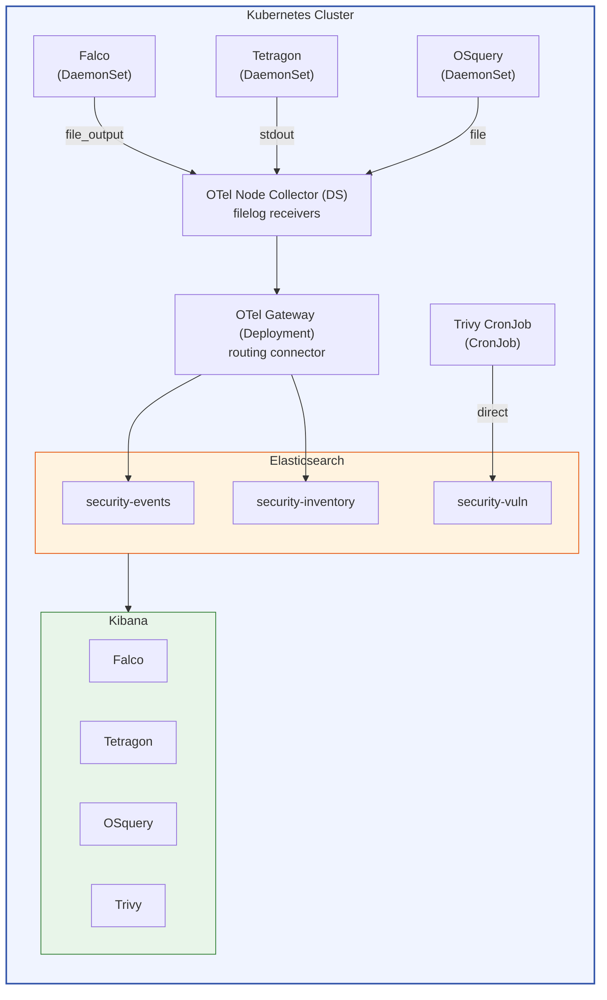

### CTEM 5단계 매핑

| CTEM 단계 | 보안 도구 | ES 인덱스 | 역할 |
|-----------|----------|-----------|------|
| **Scope** (범위 식별) | OSquery | `security-inventory` | 시스템 자산 인벤토리 수집 |
| **Discovery** (발견) | Trivy | `security-vuln` | 컨테이너 이미지 CVE 스캔 |
| **Prioritization** (우선순위) | Trivy | `security-vuln` | CVSS 점수 기반 위험도 분류 |
| **Validation** (검증) | Falco, Tetragon | `security-events` | 런타임 위협 탐지 및 검증 |
| **Mobilization** (대응) | 대시보드 | Kibana | 시각화 및 대응 의사결정 |

---

## 1. Falco 대시보드 — Syscall Monitoring

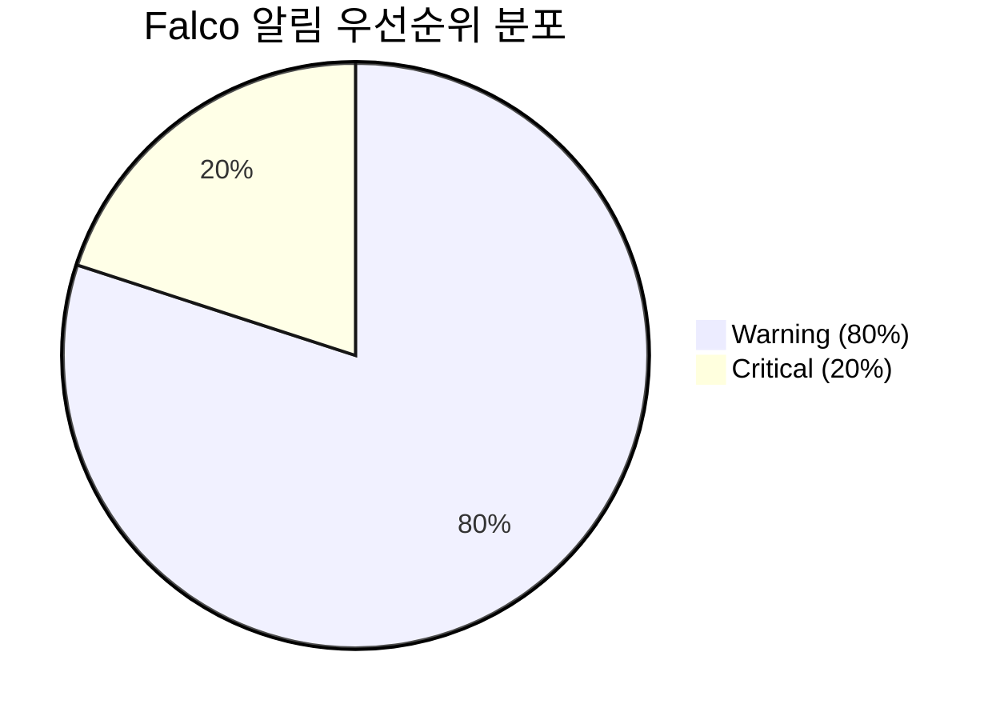

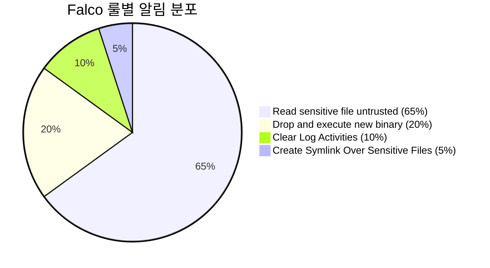

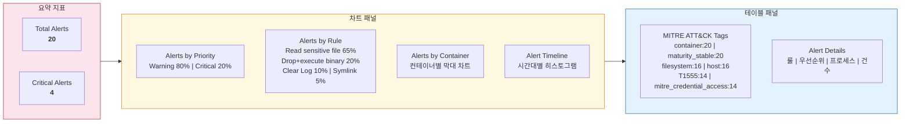

### 역할

Falco는 **eBPF 기반 시스템 콜 모니터링** 도구입니다. 커널 레벨에서 컨테이너의 시스템 콜을 실시간 감시하며, 사전 정의된 룰에 매칭되는 **이상 행위(anomaly)**가 발생하면 알림을 생성합니다.

### 대시보드 패널 설명

| 패널 | 설명 |
|------|------|
| **Total Alerts** | 탐지된 전체 보안 알림 수 (20건) |
| **Critical Alerts** | Critical 등급 알림 수 (4건) — 즉각 대응 필요 |
| **Alerts by Priority** | Warning(80%) vs Critical(20%) 비율 — 심각도 분포 파악 |
| **Alerts by Rule** | 어떤 룰이 트리거되었는지 — 공격 유형 파악 |
| **Alerts by Container** | 컨테이너별 알림 분포 — 침해된 컨테이너 식별 |
| **Alert Timeline** | 시간대별 알림 발생 추이 — 공격 시점/패턴 분석 |
| **MITRE ATT&CK Tags** | MITRE 프레임워크 매핑 — 공격 전술/기법 분류 |
| **Alert Details** | 룰/심각도/프로세스별 상세 테이블 |

### 탐지된 위협

#### 1) Read sensitive file untrusted (Warning) — 13건

```
Rule: Read sensitive file untrusted
MITRE: T1555 (Credential Access)
Process: /bin/busybox (cat), /usr/bin/cat
File: /etc/shadow
```

**위협 설명**: 컨테이너 내에서 `/etc/shadow` 파일을 읽는 행위가 탐지되었습니다. `/etc/shadow`는 시스템 사용자의 해시된 비밀번호가 저장된 파일로, 공격자가 **자격 증명 탈취(Credential Access)**를 시도할 때 가장 먼저 접근하는 파일입니다.

**MITRE ATT&CK 매핑**:
- **T1555**: Credentials from Password Stores — 비밀번호 저장소에서 자격 증명을 추출하는 기법

**탐지 근거**: 신뢰되지 않은 프로세스(`busybox cat`)가 민감 파일을 읽었기 때문에 트리거되었습니다. 정상적인 컨테이너 운영에서는 shadow 파일을 읽을 이유가 없습니다.

#### 2) Drop and execute new binary in container (Critical) — 4건

```
Rule: Drop and execute new binary in container
MITRE: TA0003 (Persistence), PCI_DSS_11.5.1
Process: /usr/bin/mount, /usr/bin/umount
Flags: EXE_WRITABLE|EXE_UPPER_LAYER
```

**위협 설명**: 컨테이너의 원본 이미지에 포함되지 않은 바이너리가 실행되었습니다. 이는 공격자가 **악성 바이너리를 컨테이너에 삽입(Drop)하고 실행**하는 전형적인 **지속성 확보(Persistence)** 공격 패턴입니다.

**MITRE ATT&CK 매핑**:
- **TA0003**: Persistence — 시스템 재시작 후에도 접근을 유지하기 위한 기법

**탐지 근거**: `EXE_WRITABLE|EXE_UPPER_LAYER` 플래그는 해당 바이너리가 컨테이너 이미지의 원본 레이어가 아닌 **쓰기 가능한 상위 레이어(OverlayFS)**에서 실행되었음을 의미합니다. 이는 컨테이너 런타임에 새로 추가된 파일임을 나타냅니다.

#### 3) Clear Log Activities (Warning) — 2건

```
Rule: Clear Log Activities
Process: (empty), /usr/local/bin/containerd-shim-runc-v2
```

**위협 설명**: 로그 파일을 삭제하거나 비우는 행위가 탐지되었습니다. 공격자는 침입 흔적을 지우기 위해 **로그 삭제(Log Clearing)**를 수행하며, 이는 **방어 회피(Defense Evasion)** 전술의 일부입니다.

#### 4) Create Symlink Over Sensitive Files (Warning) — 1건

```
Rule: Create Symlink Over Sensitive Files
Process: /bin/busybox
```

**위협 설명**: 민감 파일(`/etc/shadow`)에 대한 심볼릭 링크가 생성되었습니다. 공격자는 symlink를 통해 접근 통제를 우회하여 민감 파일을 읽을 수 있습니다. 이는 **Symlink Race** 또는 **Path Traversal** 공격의 일부입니다.

---

## 2. Tetragon 대시보드 — Process Monitoring

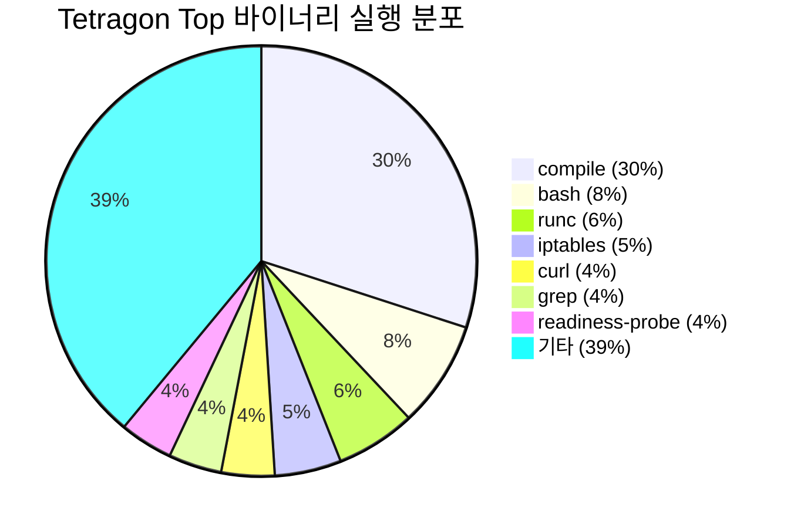

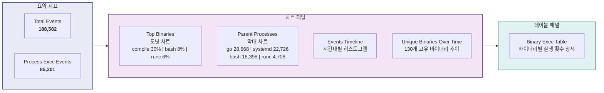

### 역할

Tetragon은 **eBPF 기반 프로세스 모니터링** 도구입니다. Falco가 룰 기반으로 이상 행위만 탐지하는 것과 달리, Tetragon은 **모든 프로세스의 실행(exec)과 종료(exit) 이벤트를 기록**합니다. 이를 통해 시스템에서 어떤 프로세스가 언제, 누구에 의해, 어떤 인자로 실행되었는지 전체 이력을 추적할 수 있습니다.

### 대시보드 패널 설명

| 패널 | 설명 |
|------|------|
| **Total Events** | 전체 프로세스 이벤트 수 (188,582건: exec 85,201 + exit 103,381) |
| **Process Exec Events** | 프로세스 실행 이벤트 수 |
| **Top Binaries** (도넛 차트) | 가장 많이 실행된 바이너리 — 비정상 바이너리 식별 |
| **Parent Processes** (막대 차트) | 부모-자식 프로세스 관계 — 공격 체인 추적 |
| **Events Timeline** | 시간대별 이벤트 발생량 — 이상 스파이크 탐지 |
| **Binary Exec Table** | 바이너리별 실행 횟수 상세 테이블 |
| **Unique Binaries Over Time** | 시간대별 고유 바이너리 수 — 신규 바이너리 출현 탐지 |

### 탐지된 활동 분석

#### Top 실행 바이너리 (130개 고유 바이너리)

| 바이너리 | 실행 횟수 | 분석 |
|----------|-----------|------|
| `/usr/local/go/.../compile` | 26,413 | Go 컴파일러 — Operator 빌드 활동 (정상) |
| `/usr/bin/bash` | 7,325 | Shell 실행 — 정상/비정상 혼재, 컨텍스트 확인 필요 |
| `/usr/local/sbin/runc` | 5,576 | 컨테이너 런타임 — 컨테이너 생성/관리 (정상) |
| `/usr/sbin/iptables` | 4,348 | 네트워크 룰 — kube-proxy 활동 (정상) |
| `/usr/bin/curl` | 3,763 | HTTP 클라이언트 — 외부 통신, 데이터 유출 가능성 |
| `/usr/bin/grep`, `/usr/bin/tr`, `/usr/bin/cut` | ~3,700 | 텍스트 처리 — 스크립트 실행 패턴 |
| `readiness-probe-script.sh` | 3,662 | ES 헬스체크 스크립트 (정상) |

#### 부모 프로세스 분석

| 부모 프로세스 | 자식 실행 수 | 의미 |
|---------------|-------------|------|
| `/usr/local/go/bin/go` | 28,668 | Go 빌드 시스템에서 대량 프로세스 생성 |
| `/usr/lib/systemd/systemd` | 22,726 | 시스템 서비스 프로세스 |
| `/usr/bin/bash` | 18,398 | Shell에서 실행된 명령 — 수동 작업 또는 스크립트 |
| `/usr/local/sbin/runc` | 4,708 | 컨테이너 내부 프로세스 실행 |

#### 활용 방법

Tetragon 데이터는 **포렌식(Forensics)** 목적으로 활용됩니다:

1. **공격 체인 재구성**: 부모-자식 프로세스 관계를 따라 공격자의 행위를 시간순으로 재구성
2. **이상 바이너리 탐지**: "Unique Binaries Over Time" 차트에서 갑자기 새로운 바이너리가 출현하면 공격 의심
3. **Timeline 스파이크 분석**: 평소보다 프로세스 실행이 급증하는 시점은 자동화된 공격 도구 실행 가능성
4. **Lateral Movement 추적**: `runc` → `bash` → `curl` 체인이 보이면 컨테이너 탈출 후 내부 이동 가능성

---

## 3. Trivy 대시보드 — Vulnerability Scanner

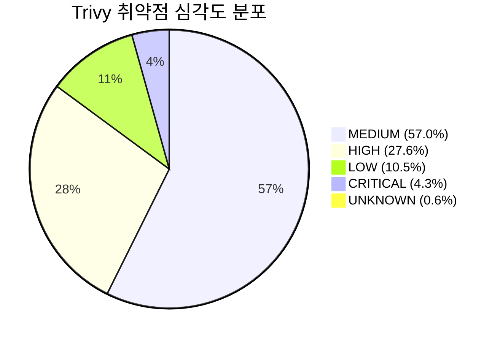

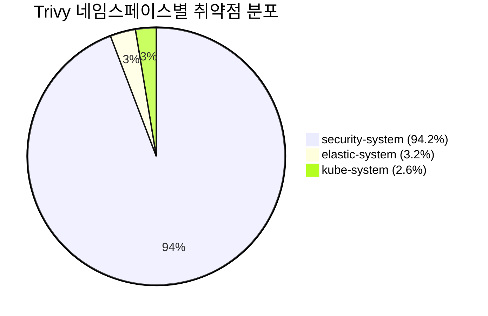

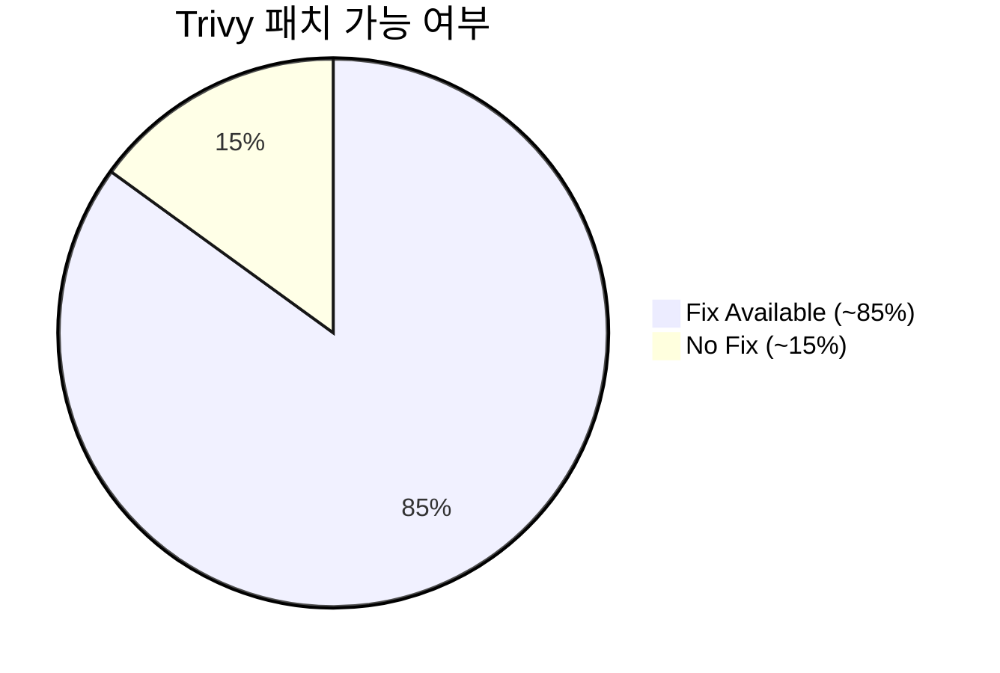

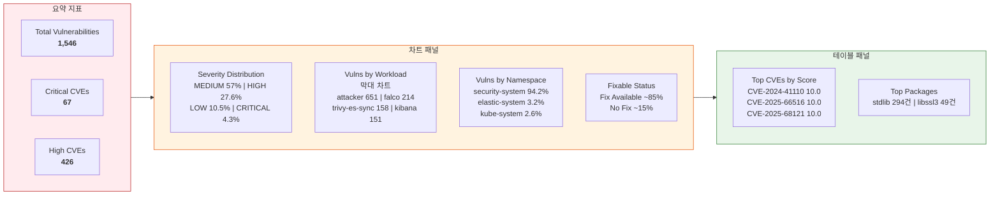

### 역할

Trivy는 **컨테이너 이미지 취약점(CVE) 스캐너**입니다. 클러스터에서 실행 중인 모든 워크로드의 컨테이너 이미지를 스캔하여 알려진 취약점(CVE)을 탐지합니다. CronJob으로 주기적(6시간마다)으로 VulnerabilityReport CRD를 읽어 Elasticsearch에 인덱싱합니다.

### 대시보드 패널 설명

| 패널 | 설명 |
|------|------|
| **Total Vulnerabilities** | 전체 탐지 CVE 수 (1,546건) |
| **Critical CVEs** | CVSS 9.0+ 등급 (67건) — 즉시 패치 필요 |
| **High CVEs** | CVSS 7.0~8.9 등급 (426건) — 우선 패치 대상 |
| **Severity Distribution** | 심각도별 분포 — 전체 위험도 파악 |
| **Vulns by Workload** | 워크로드별 취약점 수 — 가장 위험한 이미지 식별 |
| **Vulns by Namespace** | 네임스페이스별 분포 — 영향 범위 파악 |
| **Top CVEs by Score** | CVSS 점수 최상위 CVE — 우선 대응 대상 |
| **Top Packages** | 가장 취약한 패키지 — 패키지 업데이트 대상 |
| **Fixable Status** | 패치 가능 vs 불가능 — 실질적 대응 가능성 |

### 탐지된 취약점 분석

#### 심각도 분포

| 심각도 | 건수 | 비율 | 의미 |
|--------|------|------|------|
| **CRITICAL** | 67 | 4.3% | 원격 코드 실행, 인증 우회 가능 — **즉시 패치** |
| **HIGH** | 426 | 27.6% | 권한 상승, 정보 유출 가능 — **우선 패치** |
| **MEDIUM** | 881 | 57.0% | 제한적 영향 — 계획적 패치 |
| **LOW** | 163 | 10.5% | 경미한 영향 — 정기 업데이트 시 포함 |
| **UNKNOWN** | 9 | 0.6% | 분류 미완 — 추가 분석 필요 |

#### 최고 위험 CVE (CVSS 10.0)

| CVE ID | CVSS | 위협 |
|--------|------|------|
| **CVE-2024-41110** | 10.0 | Docker Engine AuthZ 플러그인 우회 — 인증 없이 Docker API 접근 가능 |
| **CVE-2025-66516** | 10.0 | 원격 코드 실행 취약점 |
| **CVE-2025-68121** | 10.0 | 원격 코드 실행 취약점 |
| **CVE-2019-20933** | 9.8 | InfluxDB 인증 우회 |
| **CVE-2023-24538** | 9.8 | Go html/template 코드 인젝션 |

#### 워크로드별 위험도

| 워크로드 | CVE 수 | 위험 평가 |
|----------|--------|----------|
| **attacker** (테스트 공격 Pod) | 651 | 의도적으로 취약한 이미지 (27 CRITICAL) |
| **falco** | 214 | 보안 도구 자체의 의존성 취약점 |
| **trivy-es-sync** | 158 | Alpine 기반 이미지 취약점 |
| **kibana** | 151 | UI 도구 의존성 취약점 |
| **elasticsearch** | 135 | 데이터 저장소 의존성 취약점 |

#### 네임스페이스별 영향

| 네임스페이스 | CVE 수 | 비율 |
|-------------|--------|------|
| **security-system** | 1,456 | 94.2% — 보안 도구 + 테스트 Pod 집중 |
| **elastic-system** | 50 | 3.2% |
| **kube-system** | 40 | 2.6% |

#### 패치 가능 분석

**Fixable Status** 차트에서 대부분의 CVE에 패치 버전이 제공됩니다. `package.fixed_version` 필드가 존재하면 해당 패키지를 업데이트하여 취약점을 해소할 수 있습니다.

#### 가장 취약한 패키지

| 패키지 | CVE 수 | 주요 심각도 |
|--------|--------|-----------|
| **stdlib** (Go 표준 라이브러리) | 170 (MEDIUM), 106 (HIGH), 18 (CRITICAL) | Go 런타임 업데이트 필요 |
| **libssl3** | 39 (MEDIUM), 10 (HIGH) | OpenSSL 업데이트 필요 |

---

## 4. OSquery 대시보드 — System Inventory

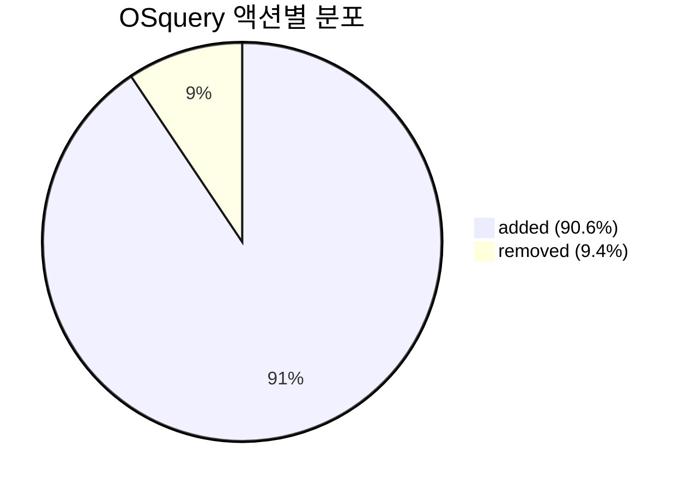

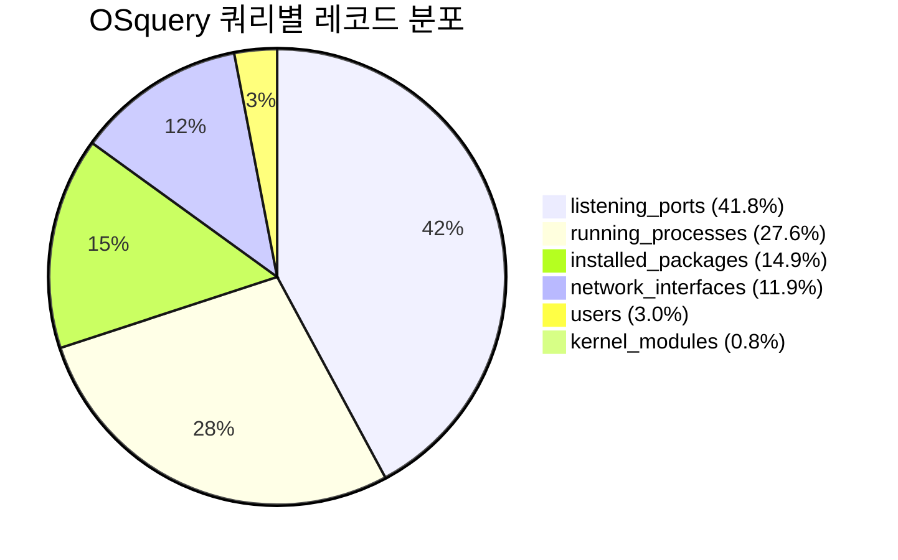

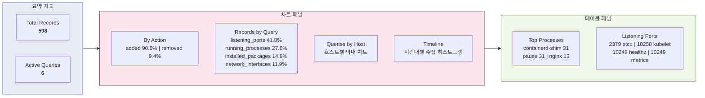

### 역할

OSquery는 **SQL 기반 시스템 인벤토리 수집기**입니다. 운영체제를 SQL 데이터베이스처럼 쿼리하여 실행 중인 프로세스, 열린 포트, 설치된 패키지, 네트워크 인터페이스, 사용자, 커널 모듈 등의 시스템 상태를 주기적으로 수집합니다.

CTEM의 **Scope(범위 식별)** 단계에서 보호 대상 자산을 파악하는 데 핵심적인 역할을 합니다.

### 대시보드 패널 설명

| 패널 | 설명 |
|------|------|
| **Total Records** | 전체 인벤토리 레코드 수 (598건) |
| **Active Queries** | 활성 쿼리 종류 수 (6종) |
| **By Action** | added(90.6%) vs removed(9.4%) — 자산 변동 추이 |
| **Records by Query** | 쿼리 유형별 분포 — 어떤 인벤토리가 수집되는지 |
| **Queries by Host** | 호스트별 수집 현황 — 노드 커버리지 확인 |
| **Timeline** | 시간대별 수집 추이 — 수집 누락 탐지 |
| **Top Processes** | 가장 많이 관찰된 프로세스 — 비정상 프로세스 식별 |
| **Listening Ports** | 열린 포트 목록 — 예상치 못한 포트 탐지 |

### 수집된 인벤토리 분석

#### 쿼리 유형별 수집

| 쿼리 | 레코드 수 | 수집 항목 |
|------|-----------|----------|
| **listening_ports** | 250 (41.8%) | 열린 네트워크 포트 — 공격 표면(Attack Surface) 파악 |
| **running_processes** | 165 (27.6%) | 실행 중인 프로세스 — 비정상 프로세스 탐지 |
| **installed_packages** | 89 (14.9%) | 설치된 패키지 — 취약 패키지 식별 |
| **network_interfaces** | 71 (11.9%) | 네트워크 인터페이스 — 네트워크 구성 파악 |
| **users** | 18 (3.0%) | 시스템 사용자 — 비인가 계정 탐지 |
| **kernel_modules** | 5 (0.8%) | 커널 모듈 — 루트킷/악성 모듈 탐지 |

#### 관찰된 프로세스 (running_processes)

| 프로세스 | added | removed | 의미 |
|----------|-------|---------|------|
| **containerd-shim** | 31 | 9 | 컨테이너 런타임 shim (정상) |
| **pause** | 31 | 9 | K8s Pod 인프라 컨테이너 (정상) |
| **nginx** | 13 | — | 웹 서버 (target-nginx Pod) |
| **falco** | 11 | — | 보안 모니터링 도구 |
| **sh** | 8 | — | Shell 프로세스 — 실행 컨텍스트 확인 필요 |
| **manager** | 7 | — | Operator 매니저 프로세스 |

#### 발견된 열린 포트 (listening_ports)

| 포트 | 프로토콜 | 서비스 |
|------|---------|--------|
| **0** | — | 비할당 포트 (소켓 바인딩) |
| **2379** | TCP | etcd 클라이언트 포트 |
| **10248** | TCP | kubelet healthz |
| **10249** | TCP | kube-proxy metrics |
| **10250** | TCP | kubelet API — **보안 주의** (인증 필요) |
| **10256** | TCP | kube-proxy healthz |
| **10257** | TCP | kube-controller-manager |
| **10259** | TCP | kube-scheduler |

#### 활용 방법

1. **Attack Surface 관리**: `listening_ports` 데이터로 예상치 못한 포트가 열려 있는지 확인
2. **비정상 프로세스 탐지**: `running_processes`에서 알 수 없는 프로세스가 `added`되었는지 모니터링
3. **컴플라이언스 점검**: `installed_packages`와 `kernel_modules`로 승인되지 않은 소프트웨어 설치 여부 확인
4. **사용자 감사**: `users` 쿼리로 비인가 계정 생성 여부 감시

---

## 위협 테스트 시나리오 재현 방법

### Falco 알림 트리거

```bash
# 1. 민감 파일 읽기 (T1555 Credential Access)
kubectl exec -n security-system attacker -- cat /etc/shadow

# 2. Symlink 공격
kubectl exec -n security-system attacker -- sh -c \
  'ln -sf /etc/shadow /tmp/shadow-link; cat /tmp/shadow-link'

# 3. 패키지 매니저 실행 (컨테이너 내 소프트웨어 설치)
kubectl exec -n security-system target-nginx -- apt-get update

# 4. DNS 요청 (C2 통신 시뮬레이션)
kubectl exec -n security-system attacker -- nslookup evil.example.com
```

### Trivy 취약점 스캔 수동 실행

```bash
# VulnerabilityReport → ES 인덱싱 수동 트리거
kubectl create job --from=cronjob/trivy-es-sync trivy-manual \
  -n security-system
```

---

## 대시보드 접근 방법

### Port-forward 설정

```bash
# Kibana 접속
kubectl port-forward svc/ctem-kibana-kb-http 5601 -n security-system

# Elasticsearch 직접 접근 (디버깅용)
kubectl port-forward svc/ctem-es-es-http 9200 -n security-system
```

### Kibana 로그인

- URL: `https://localhost:5601`
- Username: `elastic`
- Password: `kubectl get secret ctem-es-es-elastic-user -n security-system -o jsonpath='{.data.elastic}' | base64 -d`

### 대시보드 목록

| 대시보드 ID | 제목 | 시간 범위 |
|------------|------|----------|
| `falco-dashboard` | [CTEM] Falco - Syscall Monitoring | Last 1 hour |
| `tetragon-dashboard` | [CTEM] Tetragon - Process Monitoring | Last 24 hours |
| `trivy-dashboard` | [CTEM] Trivy - Vulnerability Scanner | Last 7 days |
| `osquery-dashboard` | [CTEM] OSquery - System Inventory | Last 24 hours |
| `ctem-security-dashboard` | CTEM Security Overview (통합) | Last 7 days |

### 대시보드 NDJSON 임포트 (초기 설정)

```bash
ES_PASS=$(kubectl get secret ctem-es-es-elastic-user -n security-system \
  -o jsonpath='{.data.elastic}' | base64 -d)

for f in config/elasticsearch/dashboards/*-dashboard.ndjson; do
  echo "Importing $f..."
  curl -sk -u "elastic:$ES_PASS" \
    -X POST "https://localhost:5601/api/saved_objects/_import?overwrite=true" \
    -H "kbn-xsrf: true" \
    -F "file=@$f"
  echo ""
done
```

---

## ES 인덱스 구조

### security-events (Falco + Tetragon)

```
Attributes.log.file.path    — 소스 도구 식별 (falco/tetragon)
Attributes.rule              — Falco 룰 이름
Attributes.priority          — 심각도 (Critical/Warning/...)
Attributes.tags[]            — MITRE ATT&CK 태그
Attributes.output_fields     — 상세 필드 (process, container, user, file)
Attributes.process_exec      — Tetragon 프로세스 실행 이벤트
Attributes.process_exit      — Tetragon 프로세스 종료 이벤트
```

### security-vuln (Trivy)

```
vulnerability.id             — CVE ID
vulnerability.severity       — 심각도 (CRITICAL/HIGH/MEDIUM/LOW)
vulnerability.score.base     — CVSS 점수
package.name                 — 취약 패키지명
package.installed_version    — 설치된 버전
package.fixed_version        — 패치 버전
workload.namespace           — K8s 네임스페이스
workload.name                — 워크로드 이름
workload.image.name          — 컨테이너 이미지
```

### security-inventory (OSquery)

```
Attributes.name              — 쿼리 이름 (running_processes, listening_ports, ...)
Attributes.action            — 변경 유형 (added/removed)
Attributes.hostIdentifier    — 호스트명
Attributes.columns           — 쿼리 결과 컬럼 (name, pid, port, protocol, ...)
```
