# CTEM Security Operator - 위협 탐지 파이프라인 아키텍처

## 목차

1. [전체 아키텍처 개요](#1-전체-아키텍처-개요)
2. [데이터 흐름 전체도](#2-데이터-흐름-전체도)
3. [Falco — eBPF 기반 실시간 위협 탐지](#3-falco--ebpf-기반-실시간-위협-탐지)
4. [Tetragon — eBPF kprobe 기반 커널 이벤트 모니터링](#4-tetragon--ebpf-kprobe-기반-커널-이벤트-모니터링)
5. [OSquery — SQL 기반 호스트 인벤토리 수집](#5-osquery--sql-기반-호스트-인벤토리-수집)
6. [Trivy — 컨테이너 이미지 취약점 스캔](#6-trivy--컨테이너-이미지-취약점-스캔)
7. [OTel Pipeline — 통합 로그 수집/라우팅](#7-otel-pipeline--통합-로그-수집라우팅)
8. [Elasticsearch 인덱스와 CTEM 매핑](#8-elasticsearch-인덱스와-ctem-매핑)
9. [Reconciler 7단계 루프](#9-reconciler-7단계-루프)
10. [활용 시나리오](#10-활용-시나리오)

---

## 1. 전체 아키텍처 개요

Security Operator는 단일 CRD(`SecurityAgent`)로 4개 보안 도구와 OTel 로그 파이프라인을 통합 관리한다.
각 도구는 **Feature-as-Plugin** 패턴으로 구현되어 독립적으로 활성화/비활성화할 수 있다.

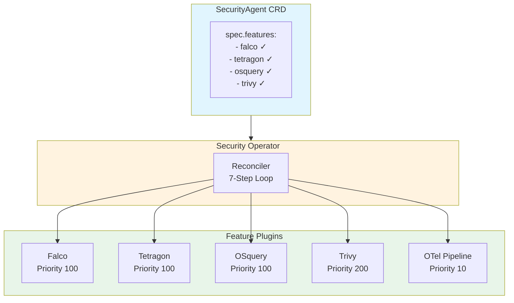

### 핵심 원칙

| 원칙 | 설명 |
|---|---|
| **Feature 독립성** | 각 도구는 `Feature` 인터페이스 4개 메서드만 구현하면 됨 |
| **OTel 중심 수집** | Falco/Tetragon/OSquery → 파일 출력 → OTel filelog → ES |
| **Trivy 예외 경로** | CronJob이 VulnerabilityReport CRD를 읽어 ES에 직접 POST |
| **SSA 기반 배포** | 모든 리소스는 Server-Side Apply로 선언적 관리 |

---

## 2. 데이터 흐름 전체도

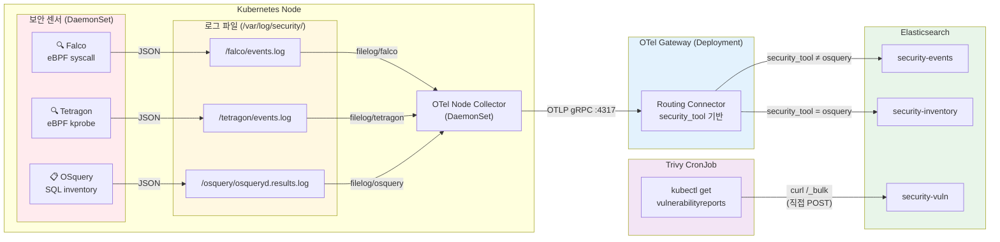

---

## 3. Falco — eBPF 기반 실시간 위협 탐지

### 3.1 역할

Falco는 Linux 커널의 syscall을 **modern_ebpf** 드라이버로 모니터링하여 **규칙 기반 위협 탐지**를 수행한다.
파일 접근, 프로세스 실행, 네트워크 연결 등 커널 수준 이벤트를 실시간으로 분석하고, 사전 정의된 규칙에 매칭되면 경고를 발생시킨다.

### 3.2 위협 탐지 방식

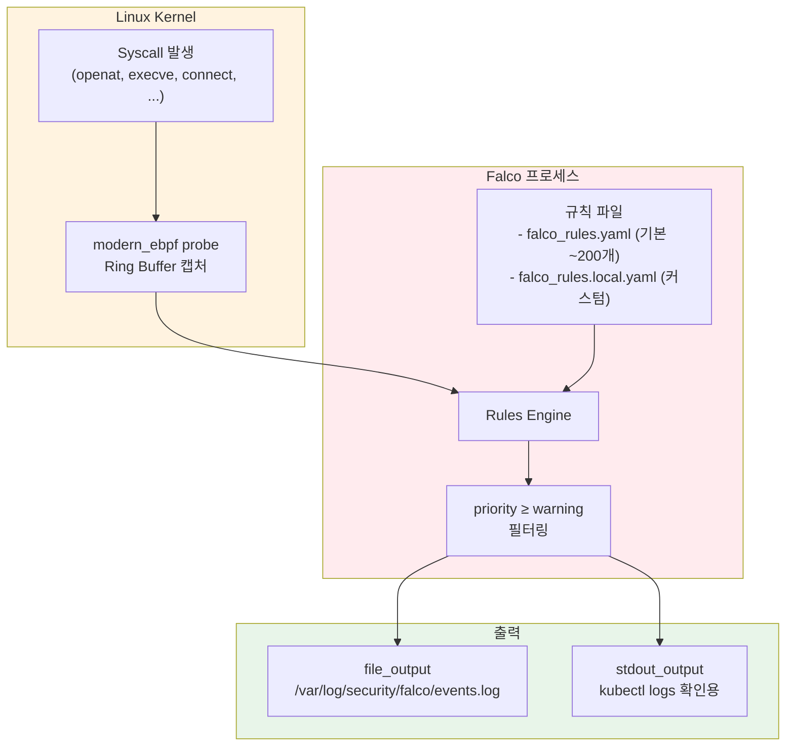

### 3.3 탐지 규칙 예시 (MITRE ATT&CK 매핑)

| Falco Rule | MITRE ID | 탐지 대상 | Priority |
|---|---|---|---|
| Read sensitive file untrusted | T1555 | `cat /etc/shadow`, `cat /etc/passwd` | Warning |
| Create Symlink Over Sensitive Files | T1555 | `ln -s /etc/shadow /tmp/link` | Warning |
| Drop and execute new binary in container | TA0003 | 컨테이너 이미지에 없는 바이너리 실행 | Critical |
| Contact K8S API Server From Container | T1071 | 컨테이너에서 K8s API 호출 | Notice |
| Launch Privileged Container | T1610 | privileged 컨테이너 시작 | Warning |
| Modify binary dirs | T1222 | `/usr/bin` 등 시스템 디렉터리 변경 | Critical |

### 3.4 배포 리소스

| 리소스 | 이름 | 설명 |
|---|---|---|
| DaemonSet | `falco` | 모든 노드에 Falco 센서 배포 (privileged, hostPID) |
| ConfigMap | `falco-config` | `falco.yaml` + `falco_rules.local.yaml` |
| ServiceAccount | `falco` | Pod/Node 메타데이터 조회용 |
| ClusterRole | `falco` | pods, nodes, namespaces 읽기 권한 |
| ClusterRoleBinding | `falco` | SA-ClusterRole 바인딩 |

### 3.5 출력 데이터 형식

```json
{
  "hostname": "falco-xngrk",
  "priority": "Warning",
  "rule": "Read sensitive file untrusted",
  "source": "syscall",
  "tags": ["T1555", "container", "filesystem", "mitre_credential_access"],
  "time": "2026-02-25T16:02:10.100341890Z",
  "output": "Warning Sensitive file opened for reading by non-trusted program (file=/etc/shadow ...)",
  "output_fields": {
    "container.id": "0402774d596a",
    "evt.type": "openat",
    "fd.name": "/etc/shadow",
    "proc.cmdline": "cat /etc/shadow",
    "proc.exepath": "/bin/busybox",
    "user.name": "root",
    "user.uid": 0
  }
}
```

### 3.6 OTel 수집 설정

```go
OTelReceiverConfig{
    ReceiverName: "filelog/falco",
    LogPath:      "/var/log/security/falco/events.log*",
    ParseFormat:  "json",
    Attributes:   {"security_tool": "falco"},
    TargetIndex:  "events",
}
```

OTel Node Collector가 `filelog/falco` 리시버로 로그 파일을 tail하고, JSON 파싱 후 `security_tool=falco` 속성을 부여하여 Gateway로 전송한다.

---

## 4. Tetragon — eBPF kprobe 기반 커널 이벤트 모니터링

### 4.1 역할

Tetragon은 Cilium 프로젝트의 eBPF 기반 보안 관측 도구로, **kprobe/tracepoint를 활용한 커널 함수 수준 모니터링**을 수행한다.
Falco가 규칙 기반 "이벤트 분류"에 집중한다면, Tetragon은 **프로세스 실행/종료의 전수 기록**과 **TracingPolicy CRD를 통한 커널 함수 후킹**에 강점이 있다.

### 4.2 위협 탐지 방식

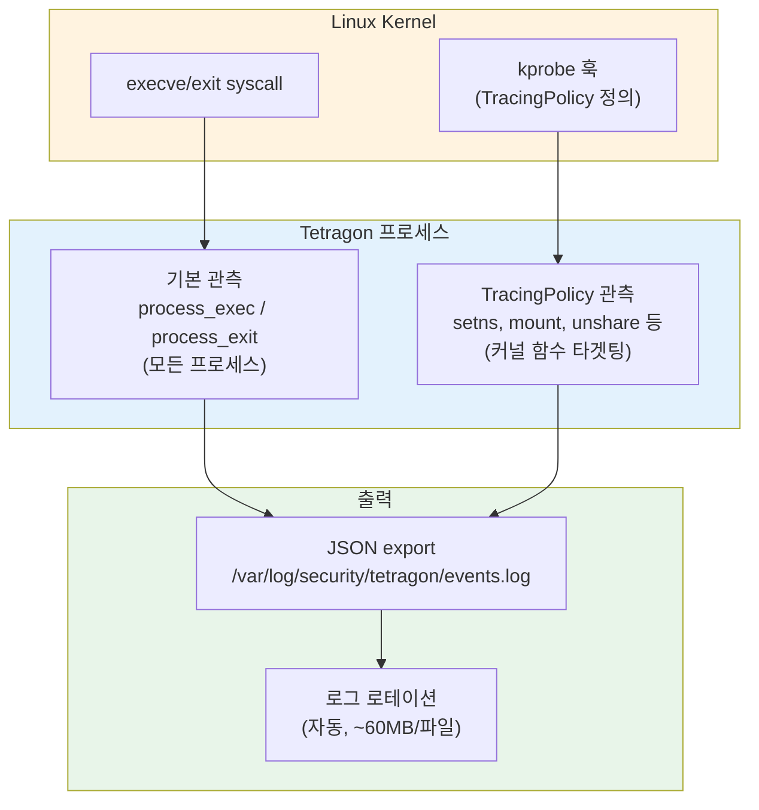

### 4.3 Falco vs Tetragon 비교

| 항목 | Falco | Tetragon |
|---|---|---|
| **eBPF 방식** | modern_ebpf (syscall ring buffer) | kprobe + tracepoint |
| **탐지 로직** | 규칙(YAML) 기반 분류 | TracingPolicy CRD로 커널 함수 후킹 |
| **출력 내용** | 규칙 매칭된 이벤트만 | 전체 프로세스 exec/exit + Policy 매칭 |
| **데이터 양** | 적음 (규칙 필터링) | 많음 (전수 기록) |
| **MITRE 매핑** | 규칙에 태그 내장 | 사용자가 Policy에서 정의 |
| **강점** | 풍부한 기본 규칙 (~200개) | 커널 함수 수준 세밀한 관측 |
| **상호보완** | "무엇이 의심스러운가" | "정확히 무엇이 실행되었는가" |

### 4.4 TracingPolicy (컨테이너 탈출 감지)

Operator가 배포하는 `container-escape-monitor` TracingPolicy는 다음 커널 함수를 모니터링한다:

| 커널 함수 | 탐지 대상 | MITRE |
|---|---|---|
| `__x64_sys_setns` | namespace 전환 (nsenter) | T1611 Container Escape |
| `__x64_sys_mount` | 파일시스템 마운트 | T1611 Container Escape |
| `__x64_sys_unshare` | namespace 분리 | T1611 Container Escape |

### 4.5 출력 데이터 형식

**process_exec 이벤트** (프로세스 실행):
```json
{
  "process_exec": {
    "process": {
      "binary": "/usr/bin/nsenter",
      "arguments": "-t 1 -m -u -i -n -p -- id",
      "pid": 359241,
      "uid": 0,
      "cwd": "/",
      "flags": "execve rootcwd clone",
      "start_time": "2026-02-25T16:03:27.326466803Z"
    },
    "parent": {
      "binary": "/usr/local/bin/containerd-shim-runc-v2",
      "pid": 358799
    }
  },
  "node_name": "tetragon-pxkhs",
  "time": "2026-02-25T16:03:27.326466803Z"
}
```

### 4.6 OTel 수집 설정

```go
OTelReceiverConfig{
    ReceiverName: "filelog/tetragon",
    LogPath:      "/var/log/security/tetragon/events.log*",
    ParseFormat:  "json",
    Attributes:   {"security_tool": "tetragon"},
    TargetIndex:  "events",
}
```

### 4.7 실측 데이터 (PoC 환경)

| 지표 | 값 |
|---|---|
| 24시간 로그 볼륨 | ~170MB (4개 로테이션 파일) |
| ES `security-events` 문서 수 | 181,773건 |
| `/etc/shadow` 접근 탐지 | 169건 |
| `nsenter` 실행 탐지 | 30건 |
| `mount -t proc` 탐지 | 19건 |

---

## 5. OSquery — SQL 기반 호스트 인벤토리 수집

### 5.1 역할

OSquery는 운영체제 상태를 **SQL 쿼리로 조회**하여 주기적으로 호스트 인벤토리를 수집한다.
실행 중인 프로세스, 리스닝 포트, 설치된 패키지, 사용자 계정 등 **자산 현황**을 파악하여 CTEM의 **Scope(범위 정의)** 단계에 해당하는 데이터를 생성한다.

### 5.2 데이터 수집 방식

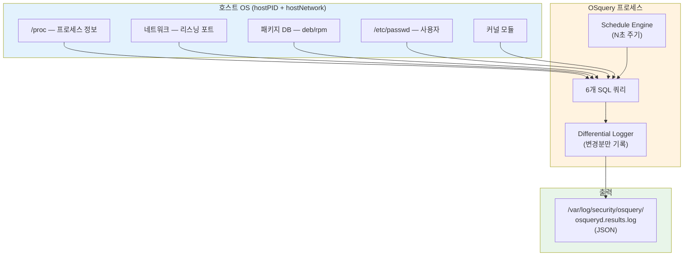

### 5.3 수집 쿼리 (Schedule Pack)

| 쿼리 이름 | SQL | 수집 내용 | CTEM 활용 |
|---|---|---|---|
| `running_processes` | `SELECT pid, name, path, cmdline, uid FROM processes` | 실행 중 프로세스 | 비인가 프로세스 탐지 |
| `listening_ports` | `SELECT pid, port, protocol, address FROM listening_ports` | 리스닝 포트 | 비인가 서비스 탐지 |
| `installed_packages` | `SELECT name, version, source FROM deb_packages UNION ...` | 설치 패키지 | 취약 패키지 식별 |
| `users` | `SELECT uid, username, shell, directory FROM users` | 사용자 계정 | 비인가 계정 탐지 |
| `network_interfaces` | `SELECT interface, address, mask FROM interface_addresses` | 네트워크 인터페이스 | 네트워크 자산 파악 |
| `kernel_modules` | `SELECT name, size, status FROM kernel_modules` | 커널 모듈 | 루트킷 탐지 |

### 5.4 Differential 모드

OSquery는 **변경분만 기록**하는 differential 모드로 동작한다:

```json
{
  "name": "running_processes",
  "action": "added",
  "columns": {
    "pid": "12345",
    "name": "suspicious_binary",
    "path": "/tmp/suspicious_binary",
    "cmdline": "/tmp/suspicious_binary --connect evil.com",
    "uid": "0"
  },
  "hostIdentifier": "ctem-local-control-plane",
  "unixTime": 1772035000
}
```

- `action: "added"` — 새로 나타난 항목 (신규 프로세스, 신규 포트 등)
- `action: "removed"` — 사라진 항목 (종료된 프로세스 등)

### 5.5 OTel 수집 설정

```go
OTelReceiverConfig{
    ReceiverName: "filelog/osquery",
    LogPath:      "/var/log/security/osquery/osqueryd.results.log*",
    ParseFormat:  "json",
    Attributes:   {"security_tool": "osquery"},
    TargetIndex:  "inventory",
}
```

`TargetIndex: "inventory"`로 설정되어 Gateway의 routing connector가 `security-inventory` 인덱스로 라우팅한다.

### 5.6 실측 데이터 (PoC 환경)

| 쿼리 | 수집 문서 수 |
|---|---|
| `listening_ports` | 250 |
| `running_processes` | 95 |
| `installed_packages` | 89 |
| `network_interfaces` | 39 |
| `users` | 18 |
| `kernel_modules` | 5 |
| **총계** | **598** |

---

## 6. Trivy — 컨테이너 이미지 취약점 스캔

### 6.1 역할

Trivy는 컨테이너 이미지의 **CVE 취약점을 스캔**하여 CTEM의 **Discovery(발견)** 및 **Prioritization(우선순위화)** 단계에 해당하는 데이터를 생성한다.

다른 도구들과 달리 **OTel 파이프라인을 사용하지 않고** CronJob이 직접 Elasticsearch에 데이터를 전송한다.

### 6.2 데이터 흐름

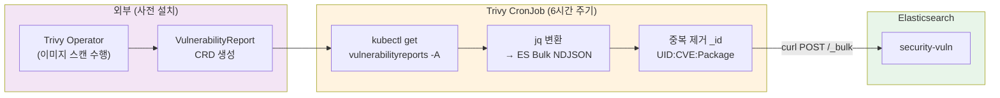

### 6.3 OTel을 사용하지 않는 이유

| 이유 | 설명 |
|---|---|
| **데이터 소스** | 파일 로그가 아닌 K8s CRD (VulnerabilityReport) |
| **실행 패턴** | 실시간 스트림이 아닌 주기적 배치 작업 |
| **데이터 구조** | 취약점 메타데이터는 OTel Log Data Model과 맞지 않음 |
| **중복 제거** | ES `_id` 기반 멱등적 upsert 필요 |

### 6.4 출력 데이터 형식

ES에 인덱싱되는 취약점 문서:

```json
{
  "@timestamp": "2026-02-25T10:30:00Z",
  "vulnerability": {
    "id": "CVE-2024-12345",
    "severity": "CRITICAL",
    "score": { "base": 9.8, "version": "3.1" },
    "title": "Remote Code Execution in libxml2",
    "fixed_version": "2.12.1",
    "primary_link": "https://nvd.nist.gov/vuln/detail/CVE-2024-12345"
  },
  "package": {
    "name": "libxml2",
    "installed_version": "2.11.0",
    "fixed_version": "2.12.1"
  },
  "workload": {
    "namespace": "default",
    "name": "my-app-deployment-abc123",
    "image": {
      "name": "gcr.io/my-app",
      "tag": "v1.0.0"
    }
  }
}
```

### 6.5 중복 제거 전략

ES 문서의 `_id`를 `<reportUID>:<CVE_ID>:<PackageName>` 형식으로 구성하여,
동일 취약점이 반복 스캔되어도 기존 문서를 업데이트(upsert)한다.

### 6.6 실측 데이터 (PoC 환경)

| 지표 | 값 |
|---|---|
| VulnerabilityReport 수 | 클러스터 내 이미지 수에 비례 |
| ES `security-vuln` 문서 수 | 1,546건 |
| CronJob 스케줄 | `0 */6 * * *` (6시간마다) |

---

## 7. OTel Pipeline — 통합 로그 수집/라우팅

### 7.1 역할

OTel Pipeline은 Falco, Tetragon, OSquery의 로그를 **중앙 수집하고 ES 인덱스로 라우팅**하는 인프라 컴포넌트다.
Priority 10으로 가장 먼저 배포되어 다른 Feature들의 로그 수집 기반을 제공한다.

### 7.2 2-Tier 아키텍처

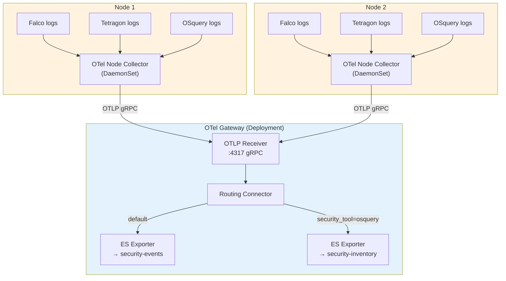

### 7.3 Node Collector 설정 (자동 생성)

Reconciler가 모든 Feature의 `OTelConfig()`를 수집하여 Node Collector ConfigMap을 자동 생성한다:

```yaml
receivers:
  filelog/falco:
    include:
      - "/var/log/security/falco/events.log*"
    start_at: beginning
    include_file_path: true
    operators:
      - type: json_parser
        parse_from: body
      - type: add
        field: resource["security_tool"]
        value: "falco"

  filelog/tetragon:
    include:
      - "/var/log/security/tetragon/events.log*"
    # ... 동일 패턴, security_tool: "tetragon"

  filelog/osquery:
    include:
      - "/var/log/security/osquery/osqueryd.results.log*"
    # ... 동일 패턴, security_tool: "osquery"

processors:
  batch:
    timeout: 5s
    send_batch_size: 1000

exporters:
  otlp:
    endpoint: "otel-gateway:4317"
    tls:
      insecure: true

service:
  pipelines:
    logs:
      receivers: [filelog/falco, filelog/tetragon, filelog/osquery]
      processors: [batch]
      exporters: [otlp]
```

### 7.4 Gateway 라우팅 로직

```yaml
connectors:
  routing:
    default_pipelines: [logs/events]
    error_mode: ignore
    table:
      - statement: route() where attributes["security_tool"] == "osquery"
        pipelines: [logs/inventory]

service:
  pipelines:
    logs/receive:
      receivers: [otlp]
      processors: [batch]
      exporters: [routing]

    logs/events:          # Falco + Tetragon → security-events
      receivers: [routing]
      exporters: [elasticsearch/events]

    logs/inventory:       # OSquery → security-inventory
      receivers: [routing]
      exporters: [elasticsearch/inventory]
```

**라우팅 규칙**:
- `security_tool == "osquery"` → `security-inventory` 인덱스
- 그 외 (falco, tetragon) → `security-events` 인덱스 (default)

### 7.5 배포 리소스

| 리소스 | 이름 | 설명 |
|---|---|---|
| Deployment | `otel-gateway` | 1 replica, OTLP gRPC :4317 수신 |
| Service | `otel-gateway` | ClusterIP, 노드 컬렉터의 엔드포인트 |
| DaemonSet | `otel-node` | 모든 노드에서 로그 파일 수집 |
| ConfigMap | `otel-gateway-config` | Gateway 설정 (라우팅 + ES 연결) |
| ConfigMap | `otel-node-collector-config` | Node 설정 (filelog 리시버) |

---

## 8. Elasticsearch 인덱스와 CTEM 매핑

### 8.1 인덱스 구조

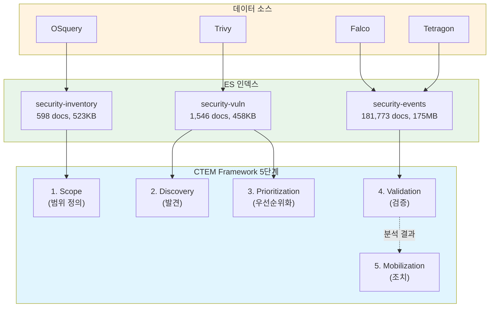

### 8.2 인덱스별 상세

| 인덱스 | CTEM 단계 | 소스 | 문서 구조 | 용도 |
|---|---|---|---|---|
| `security-inventory` | Scope | OSquery | 프로세스, 포트, 패키지, 사용자, NIC, 커널 모듈 | 자산 현황 파악 |
| `security-vuln` | Discovery + Priority | Trivy | CVE ID, 심각도, 점수, 패키지, 워크로드 | 취약점 식별 및 우선순위화 |
| `security-events` | Validation | Falco + Tetragon | Falco: 규칙 매칭 이벤트, Tetragon: 프로세스 실행/종료 | 위협 검증 및 공격 탐지 |

### 8.3 ES 문서 구조 (OTel Log Data Model)

OTel을 경유하는 문서 (Falco, Tetragon, OSquery)는 다음 공통 구조를 갖는다:

```json
{
  "@timestamp": "2026-02-25T16:02:10.100341890Z",
  "Resource": {
    "security_tool": "falco"
  },
  "Attributes": {
    "log.file.path": "/var/log/security/falco/events.log",
    "k8s.node.name": "ctem-local-control-plane"
  },
  "Body": "{ ... 원본 JSON ... }"
}
```

---

## 9. Reconciler 7단계 루프

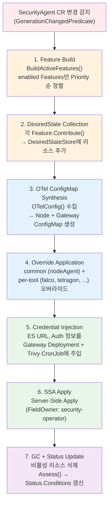

### Feature Interface

```go
type Feature interface {
    ID() FeatureID
    Configure(raw []byte) error
    Contribute(ctx context.Context, store *DesiredStateStore) error
    OTelConfig() *OTelReceiverConfig    // nil for Trivy
    Assess(ctx context.Context, c client.Client, ns string) FeatureCondition
}
```

### Self-Registration

```go
// falco/feature.go
func init() {
    feature.Register(feature.FalcoFeatureID, 100, func() feature.Feature {
        return &falcoFeature{}
    })
}

// cmd/main.go — blank import만 추가하면 Feature 자동 등록
import _ "github.com/ctem/security-operator/internal/controller/feature/falco"
```

---

## 10. 활용 시나리오

### 10.1 시나리오 A: 컨테이너 탈출 공격 탐지

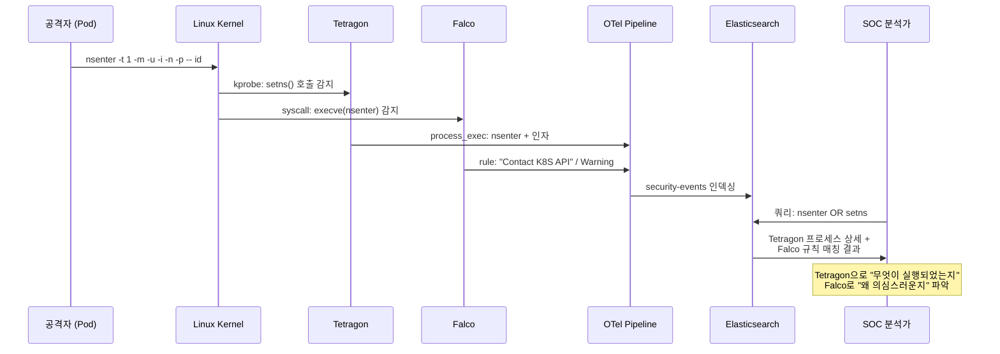

### 10.2 시나리오 B: 자산 기반 위협 상관분석

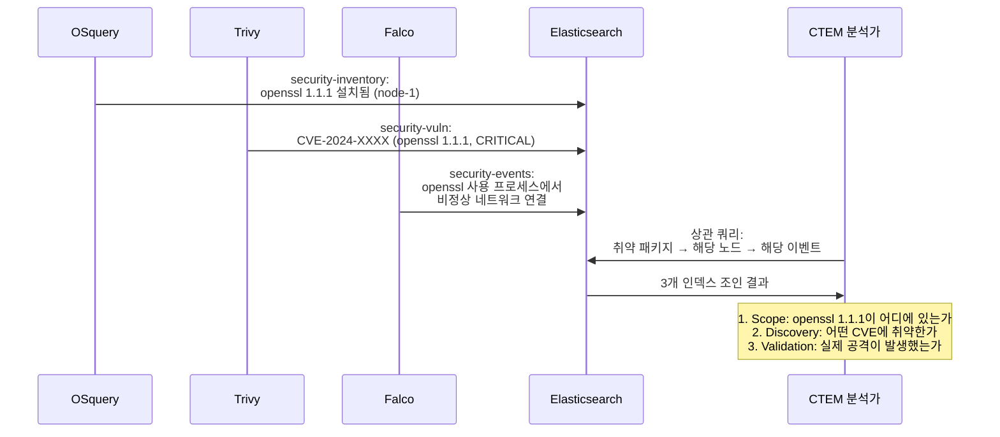

### 10.3 시나리오 C: Kibana 대시보드 활용

| 대시보드 | 데이터 소스 | 시각화 내용 |
|---|---|---|
| **위협 현황** | `security-events` | Falco 규칙별 이벤트 수, 시간대별 추이, MITRE 태그 분포 |
| **자산 현황** | `security-inventory` | 노드별 프로세스 수, 리스닝 포트, 패키지 목록 |
| **취약점 현황** | `security-vuln` | 심각도별 CVE 분포, 워크로드별 취약점 수, 패치 가능 비율 |
| **CTEM 종합** | 3개 인덱스 조인 | 자산-취약점-이벤트 상관분석, 노출면(Attack Surface) 시각화 |

### 10.4 ES 쿼리 예시

**최근 1시간 Critical/Warning Falco 이벤트:**
```json
GET security-events/_search
{
  "query": {
    "bool": {
      "must": [
        {"match_phrase": {"Body": "Read sensitive file"}},
        {"range": {"@timestamp": {"gte": "now-1h"}}}
      ]
    }
  }
}
```

**특정 노드의 리스닝 포트 현황:**
```json
GET security-inventory/_search
{
  "query": {
    "bool": {
      "must": [
        {"match_phrase": {"Body": "listening_ports"}},
        {"match_phrase": {"Body": "action\":\"added"}}
      ]
    }
  }
}
```

**CRITICAL 취약점 + 패치 가능한 것:**
```json
GET security-vuln/_search
{
  "query": {
    "bool": {
      "must": [
        {"match": {"vulnerability.severity": "CRITICAL"}},
        {"exists": {"field": "package.fixed_version"}}
      ]
    }
  }
}
```
